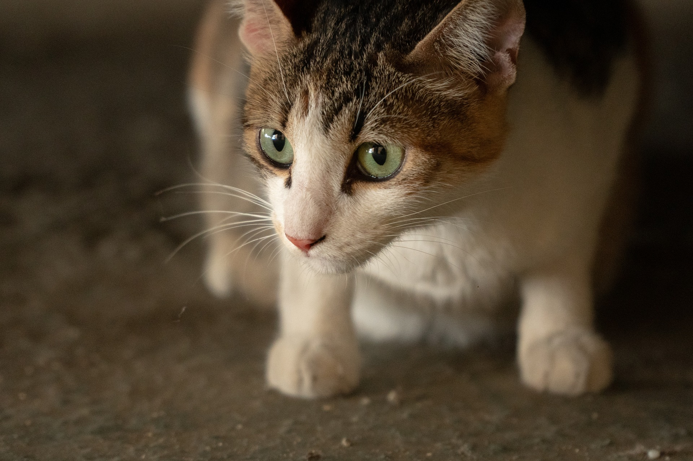

---
description: Lee et al. / Pop-Out Motion - 3D-Aware Image Deformation via Learning the Shape Laplacian / CVPR 2022
---

# Pop-Out Motion \[Korean\]

안녕하세요. 본 포스팅에서는 올해 CVPR에 발표될 Pop-Out Motion이라는 논문을 소개드리고자 합니다. 자연스러운 3D-Aware Image Deformation을 위하여 학습 기반의 파이프라인을 제안한 논문이며, `3D Vision`, `Shape Deformation`, `2D-to-3D Reconstruction` 등의 키워드에 관심이 있으신 분들이라면 [논문 본문](https://arxiv.org/pdf/2203.15235.pdf) 및 [프로젝트 페이지](https://jyunlee.github.io/projects/pop-out-motion/)를 구경해주시면 감사하겠습니다. 해당 논문은 제가 1저자로 참여하였으며, KAIST 전산학부의 성민혁교수님과 김태균교수님께서 지도해주셨습니다. (좋은 연구 지도를 해주신 두 교수님께 감사드립니다.)

##  1. Problem Definition

본 논문은 `3D-Aware Image Deformation` 이라는 문제를 해결하고자 합니다. 사용자가 이미지 내의 객체 모양을 자연스럽게 변형하는 것을 가능하게 하되, 2D 영상의 피사체가 마치 3D 공간에 존재하는 것과 같이 변형할 수 있도록 하는 것이 목표입니다. 이 때 직관적인 이미지 수정을 위하여 사용자가 키포인트 등의 `Deformation Handle` 을 매개체로서 사용할 수 있도록 합니다. 아래의 그림 예시를 보시면, 사용자가 이미지에 키포인트들 (파란색 원 표시) 을 지정하고 그 중 하나를 선택하여 움직일 경우 (빨간색 화살표 표시), 그림 내의 사람 객체 모양이 그에 맞추어 자연스럽게 변형되는 것을 볼 수 있습니다. 이 때 팔이 몸통 부분 앞에 위치하게 되거나, 한 발이 다른 발 뒤로 가려지는 등의 3D 공간에 대한 이해를 기반으로 한 영상 변형이 일어나게 됩니다. 이러한 `3D-Aware Image Deformation` 기능은 인터렉티브 영상 편집 어플리케이션 등에 유용하게 쓰일 수 있습니다.

* Insert Figure 5 of the paper

## 2. Motivation

### Related work

기존에도 3D 공간에 대한 이해를 기반으로 영상 편집을 가능하게 한 기법들이 많이 연구되어 왔지만, 글로벌한 Scene 정보 (예. 뷰포인트, 카메라 파라미터, 조명) 나 깊이 정보를 수정하는 것에 기능이 제한되어 있었습니다. Human Pose Transfer 쪽의 연구들은 영상 속 사람의 자세를 변형하는 것을 가능하게 했지만, 사람이 아닌 다른 종류 (예. 만화 캐릭터) 의 영상 속 객체에 대해서는 동작하지 않는다는 한계점이 있었습니다. 3D 모델 기반 변형 기법들은 영상 속 객체 종류에 국한되지 않고 동작한다는 장점이 있지만, 입력 영상에 대응되는 정확한 3D 모델을 필요로 한다는 단점이 존재했습니다. 이러한 한계점들을 개선하기 위하여 저희 연구에서는 객체 종류에 국한되지 않고 최대한 자유롭게 영상 변형이 가능한 프레임워크를 고안하는 것을 목표로 하였습니다.

### Idea

After you introduce related work, please illustrate the main idea of the paper. It would be great if you describe the idea by comparing or analyzing the drawbacks of the previous work.

## 3. Method


If you are writing **Author's note**, please share your know-how \(e.g., implementation details\)


The proposed method of the paper will be depicted in this section.

Please note that you can attach image files \(see Figure 1\).  
When you upload image files, please read [How to contribute?](../../how-to-contribute.md#image-file-upload) section.

We strongly recommend you to provide us a working example that describes how the proposed method works.  
Watch the professor's [lecture videos](https://www.youtube.com/playlist?list=PLODUp92zx-j8z76RaVka54d3cjTx00q2N) and see how the professor explains.

## 4. Experiment & Result


If you are writing **Author's note**, please share your know-how \(e.g., implementation details\)


This section should cover experimental setup and results.  
Please focus on how the authors of paper demonstrated the superiority / effectiveness of the proposed method.

Note that you can attach tables and images, but you don't need to deliver all materials included in the original paper.

### Experimental setup

This section should contain:

* Dataset
* Baselines
* Training setup
* Evaluation metric
* ...

### Result

Please summarize and interpret the experimental result in this subsection.

## 5. Conclusion

In conclusion, please sum up this article.  
You can summarize the contribution of the paper, list-up strength and limitation, or freely tell your opinion about the paper.

### Take home message \(오늘의 교훈\)

Please provide one-line \(or 2~3 lines\) message, which we can learn from this paper.

> All men are mortal.
>
> Socrates is a man.
>
> Therefore, Socrates is mortal.

## Author / Reviewer information


You don't need to provide the reviewer information at the draft submission stage.


### Author

**이지현 \(Jihyun Lee\)** 

* KAIST CS
* \(optional\) 1~2 line self-introduction
* Contact information \(Personal webpage, GitHub, LinkedIn, ...\)
* **...**

### Reviewer

1. Korean name \(English name\): Affiliation / Contact information
2. Korean name \(English name\): Affiliation / Contact information
3. ...

## Reference & Additional materials

1. Citation of this paper
2. Official \(unofficial\) GitHub repository
3. Citation of related work
4. Other useful materials
5. ...

