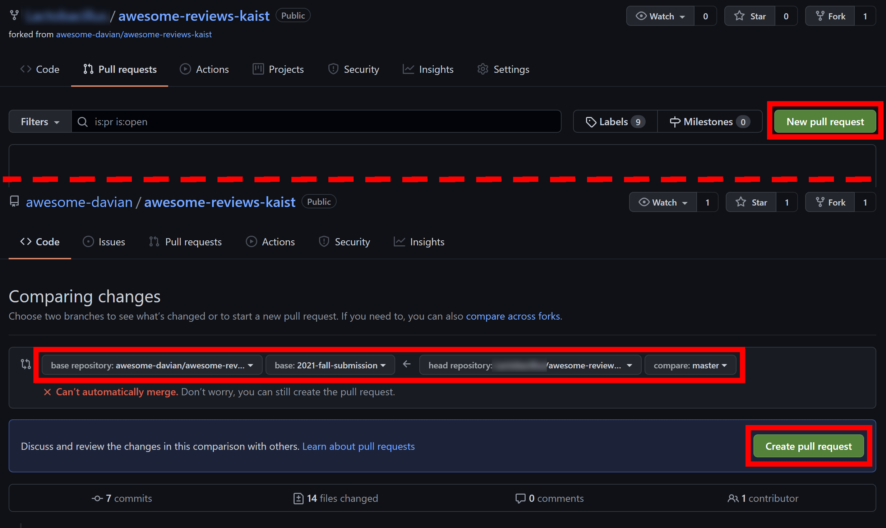

# How to contribute?

## 1. Preparing manuscript

이 장에서는 리뷰를 준비하는 과정을 다룹니다.

This section covers how to prepare your manuscript.

### Fork repository

먼저, [이 프로젝트 GitHub repository](https://github.com/awesome-davian/awesome-reviews-kaist) 를 본인의 계정으로 fork 해야 합니다.  
아래 Figure 1 을 참고해 fork 하세요.

First of all, you should fork [this GitHub repository](https://github.com/awesome-davian/awesome-reviews-kaist) to your account.  
See the Figure 1, and fork the repository.


### Write manuscript file

Fork 이후에는 자신의 계정으로 복사된 repository 의 _master_ 브랜치 \(_main_ 브랜치가 아닙니다\) 에서 초안을 자유롭게 작성하시면 됩니다.

After you fork the repository to your account, you can freely write and edit your manuscript.  
Here, you should use _master_ branch \(not _main_ branch\).

자세한 작성 방법은 준비된 템플릿 파일을 참고해주세요.

Please refer to the template files for detailed guidance.

* [Paper review / Author's note](paper-review/2021-fall-paper-review/template-paper-review.md)
* [Dive into implementation](dive-into-implementation/2021-fall-implementation/template-implementation.md)

#### Markdown & Typora

여러분의 초안은 _markdown_ 형식 \(\*.md\) 으로 작성되어야 합니다.  
Markdown 을 처음 사용하시는 분은 [링크](https://www.markdowntutorial.com/kr/)에서 사용법을 배워보세요.

Your manuscript should be written in _markdown_ \(\*.md\) format.  
If you are not familiar with markdown, see this [tutorial](https://www.markdowntutorial.com/).

추가로 [Typora](https://typora.io/) 라는 markdown 용 WYSIWYG 편집기를 사용하시면, 편하게 초안을 작성할 수 있습니다.

You can use [Typora](https://typora.io/), which is a WYSIWYG markdown editor for your convenience.

#### File name

작성한 리뷰 파일의 이름은 아래의 규칙을 따라야 합니다.

File name of your manuscript should follow the rules below:

* The file name should be a combination of the venue and the title of the paper. 파일의 이름은 논문 출판 정보 \(학회, 출판연도 등\) 와 논문 이름의 조합으로 만들어야 합니다.
* The file name should consist of alphanumeric \(_0_ to _9_, _a_ to _z_, lower case only\) and _hyphen_ \(-\). 숫자 / 영어 소문자 / 하이픈 \(-\) 만 파일명에 사용할 수 있습니다.
* Specify the language of the article in the end of the file name. 리뷰 작성 언어를 파일명 뒤에 붙여주세요.
* Examples
  * _cvpr-2021-robustnet-kor.md_        \([paper](https://openaccess.thecvf.com/content/CVPR2021/html/Choi_RobustNet_Improving_Domain_Generalization_in_Urban-Scene_Segmentation_via_Instance_Selective_CVPR_2021_paper.html)\)
  * _cvpr-2021-robustnet-eng.md_        \([paper](https://openaccess.thecvf.com/content/CVPR2021/html/Choi_RobustNet_Improving_Domain_Generalization_in_Urban-Scene_Segmentation_via_Instance_Selective_CVPR_2021_paper.html)\)
  * _iccv-2021-biaswap-kor.md_        \([paper](https://openaccess.thecvf.com/content/ICCV2021/html/Kim_BiaSwap_Removing_Dataset_Bias_With_Bias-Tailored_Swapping_Augmentation_ICCV_2021_paper.html)\)
  * _iccv-2021-sml-eng.md_        \([paper](https://openaccess.thecvf.com/content/ICCV2021/html/Jung_Standardized_Max_Logits_A_Simple_yet_Effective_Approach_for_Identifying_ICCV_2021_paper.html)\)

#### Image / file upload

리뷰에 사진이나 파일을 올려야할 경우, 아래의 경로에 저장하여야 합니다.

If you want to upload image or other files, you need to save the files in below path.

```text
/.gitbook/assets/<article_id>/<filename>
```

## 2. Submit manuscript

이 장에서는 작성한 리뷰 초안을 제출하는 방법을 설명합니다.

This section describes how to submit your prepared manuscript.

### File structure

리뷰 파일과 함께, 한 가지 파일을 더 수정해야 합니다.

Along with your manuscript file, you need to edit one more file:

```text
/SUMMARY.md
```

이 파일은 전체 페이지 구조를 담고 있으며, 여기에 작성한 리뷰 파일을 등록해주어야 합니다.  
파일에 써진 템플릿 파일 정보를 여러분이 작성한 초안 파일의 것으로 바꿔주시면 됩니다.

This file manages the whole page structure, and you need to register your manuscript in this file.  
It can be simply done by replacing information of the template file with that of your manuscript file.

#### Example



```text
# Table of contents

* [Welcome](README.md)

## Paper review

* [\[2021 Fall\] Paper review](paper-review/2021-fall-paper-review/README.md)
  * [Template \(paper review\)](paper-review/2021-fall-paper-review/template-paper-review.md)

...
```



```
# Table of contents

* [Welcome](README.md)

## Paper review

* [\[2021 Fall\] Paper review](paper-review/2021-fall-paper-review/README.md)
  * [RobustNet \[Kor\]](paper-review/2021-fall-paper-review/cvpr-2021-robustnet-kor.md)
  * [RobustNet \[Eng\]](paper-review/2021-fall-paper-review/cvpr-2021-robustnet-eng.md)

...
```



### Pull request

모든 준비가 끝나면, Figure 2 와 같이 pull request 기능을 이용해 초안을 제출합니다.

When your draft is ready, submit your work by using pull request \(see Figure 2\).



Pull request 는 학기별로 정해지는 수업용 브랜치에 보내야 합니다.  
\(e.g., 2021년 가을학기: **2021-fall-submission**\)  
**이때, 절대로** _**master**_ **브랜치에 pull request 를 보내면 안됩니다!!!**

You should create pull request to the class branch \(e.g., **2021-fall-submission** for the 2021 fall semester\).  
**WARNING: Do not send pull request to the** _**master**_ **branch!!!**

## 3. Peer review

TBD

### Github issue

TBD


