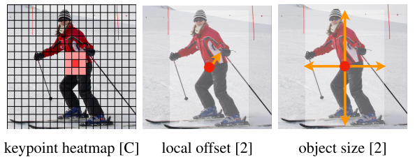
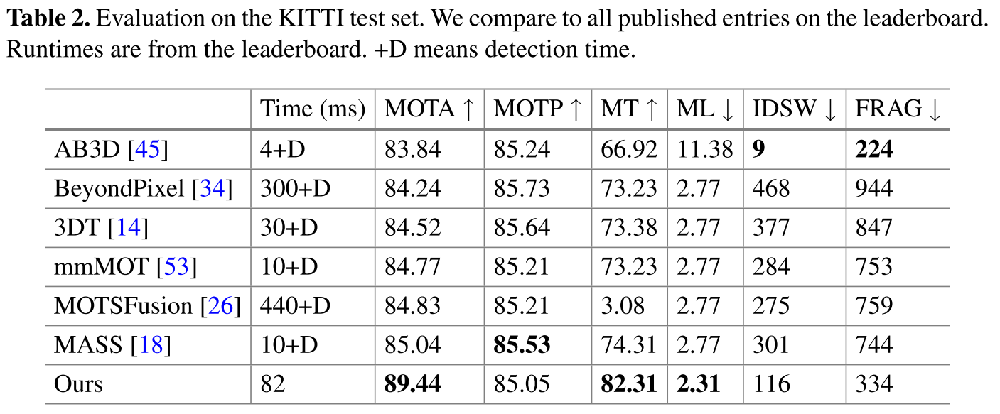

# Tracking Objects as Points \[Kor]

한국어로 쓰인 리뷰를 읽으려면 [**여기**](ECCV-2020-CenterTrack-kor.md)를 누르세요.

## 0. Introduction

CenterTrack is an image-based Multio-Object Tracking(MOT) model. Therefore, it is necessary to understand what MOT is for to figure out CenterTrack entirely.

MOT is the task of detecting objects in consecutive frames and tracking the detected objects. Here, continuous frames can be point clouds or images, etc. The reason for tracking detected objects is to understand the motion of each object. The trajectory or path of the object generated by tracking can be utilized in various fields such as action recognition and trajectory prediction.

Taking the video clip below as an example, MOT finds the location of objects in a series of images (represented as bounding boxes) and assigns the same id (described as the color of boxes) to the same object simultaneously.

![Example of MOT(multi-object tracking) 출처:GNN3DMOT[1]](../../.gitbook/assets/43/figure_mot2.gif)

##  1. Problem definition

The image-based multi-object tracking problem can be generally defined as follow.

The images from the camera at time $$t$$ and the previous frame $$t-1$$ are defined as $$I^{(t)} \in \mathbb{R}^{W \times H \times 3}$$ , $$I^{(t-1)} \in \mathbb{R}^{W \times H \times 3}$$ respectively, and detected and tracked objects' tracklets in $$t-1$$ are described as $$T^{(t-1)}=\{b_0^{(t-1)}, b_1^{(t-1)},\ldots\}$$. The purpose of the image-based MOT is to find tracklet $$T^{ (t)}=\{b_0^{(t)}, b_1^{(t)},\ldots\}$$ using $$I^{(t)}, I^{(t-1)}$$ and $$T^{(t-1)}$$ as inputs. In the tracklet of objects $$b=\{\textbf{p},\textbf{s},w,id\}$$, $$\textbf{p} \in \mathbb{R}^{2}$$ is the center point of the object location, $$\textbf{s}\in \mathbb{R}^{2}$$ is the object size, $$w \in [0,1]$$ is confidence score, and $$id \in \mathbb{L}$$ corresponds to unique identification.

## 2. Motivation

### Related work

**Tracking-by-Detection.** Previous studies for object tracking have followed the framework called Tracking-by-Detection. Methods that belong to this framework detect objects using some off-the-shelf detector and then track detected objects with a separated matching algorithm. The detection and tracking are performed in a cascade manner, which makes the detection phase not affected by the tracking phase. SORT[2], DeepSORT[3], and BeyondPixel[4] are belongs to the Tracking-by-Detection framework.

Tracking-by-Detection is a case that properly leverages well-developed detection models for multi-object tracking. However, it tends to have a slow running time and a complicated network since a complex association algorithm is necessary. Furthermore, it also has the disadvantage that object detection cannot utilize the clues of object tracking.

**Joint Detection and Tracking.** In order to tackle the limitations of Tracking-by-Detection, Joint Detection and Tracking, which performs object detection and tracking simultaneously, is being researched recently. Unlike Tracking-by-Detection, Joint Detection and Tracking extracts features for object detection and tracking through the same network. Thereby, the detection network can leverage features for tracking. Moreover, these methods effectively reduce model complexity because the association is relatively simple, and CenterTrack also falls under this method. 

### Idea

The main idea of CenterTrack is simple but powerful. It is that the association can be easily handled by representing the objects as points rather than bounding boxes. CenterTrack shows outstanding performance with only a simple greedy matching, whereas previous works leverage complex motion modeling or a separate association network to track detected objects in consecutive frames.

## 3. Method

### Preliminaries

CenterTrack is built on top of the object detector called CenterNet[5]. Therefore, I would like to briefly explain CenterNet here.

CenterNet is a monocular image-based object detection network. In contrast to existing methods that predicts object based on anchors, which is predefined bounding box templates, CenterNet is one of the anchor-free model and instead, it predicts objects as points. In detail, CenterNet takes the monocular image $$I \in \mathbb{R}^{W \times H \times 3}$$ as input and predicts a heatmap $$\hat{Y} \in [0,1]^{\frac{W}{R} \times \frac{H}{R} \times C}$$ representing the center point of the object and a size map $$\hat{S} \in \mathbb{R}^{\frac{W}{R} \times \frac{H}{R} \times C}$$. (where $$R$$ is the downsampling factor, and $$R=4$$ is used in the paper) The local maximum $$\hat{\textbf{p}} \in \mathbb{R}^2$$ in the heatmap $$\hat{Y}$$ is called the peak, and this $$\hat {\textbf{p}}$$ is predicted as the center point of the object. In the network, for each $$\hat{\textbf{p}}$$, confidence $$\hat{w} = \hat{Y}{\hat{\textbf{p}}}$$ and size $$\hat{\textbf{s}} = \hat{S}{\hat{\textbf{p}}}$$ is also predicted.

CenterTrack relies heavily on CenterNet, so please read the original paper if you need more detailed information on CenterNet.

### Tracking-Conditioned Detection

As explained, the object detection model used in CenterTrack is the same as CenterNet, but with additional inputs. While CenterNet uses only the current frame $$I^{(t)}$$ as input, CenterTrack additionally uses the image $$I^{(t-1)}$$ from the previous frame as input. In addition, CenterTrack also takes the location (center point) of objects detected in the previous frame $$\{\hat{\textbf{p}}_{0}^{(t-1)}, \hat{\textbf{p}} _{1}^{(t-1)},\ldots\}$$ as additional input. Instead of directly using center points of objects $$\{\hat{\textbf{p}}_{0}^{(t-1)}, \hat{\textbf{p}} _{1}^{(t-1)},\ldots\}$$, class-agnostic single-channel heatmap $$H^{(t-1)} = \mathcal{R}(\{\hat{\textbf{p}}_ {0}^{(t-1)}, \hat{\textbf{p}}_{1}^{(t-1)},\ldots\})$$ is used as input. In this way, CenterTrack's Tracking-Conditioned Detection makes it possible to detect objects that is invisible in the current image, such as occluded objects.

### Association Through Offsets

In CenterTrack, the two-dimensional displacement (offset) is also predicted in addition to the object's location and size. Compared with the Kalman Filter, it can be interpreted that the detection of the object location corresponds to the measurement, and the two-dimensional displacement corresponds to the prediction. This two-dimensional displacement or offset $$\hat{D}_{\textbf{p}_{i}^{(t)}} \in \mathbb{R}^{\frac{W}{R} \times \frac{H}{R} \times 2}$$ represents the distance the object moves between the current frame and the previous frame. To learn this displacement, $$L_{off}$$ is added to the loss function.

$$
L_{off} = \frac{1}{N} \sum_{i=1}^{N} |\hat{D}_{\textbf{p}_{i}^{(t)}} - (\textbf{p}_{i}^{(t-1)} - \textbf{p}_{i}^{(t)})|
$$

It is the main contribution of CenterTrack that a simple greedy matching without complicated association process is sufficient to track objects if the offset is predicted correctly since the objects are presented as points.

### Training on Video Data

CenterTrack copies all weights related to the CenterNet pipeline and uses the same training objective with the addition of offset regression $$L_{off}$$. However, there is a problem in training CenterTrack, which is that errors such as missing tracklets, wrongly localized objects, or false positives occur in inference time and degrade the model's performance. Since the model leverages the ground truth of detection as the previous frame's detection results in training, errors have a highly negative impact. 

To handle this problem, authors intentionally simulate 

To solve this, we add some kind of data agumentation in the training phase. By adding Gaussian noise to the center point of the object, or by randomly adding false positives or false negatives, we made the network robust. Also, in order to prevent overfitting in temporal characteristics, not only two consecutive frames ($$t, t-1$$) are used, but the time difference between two frames is used randomly (up to 3 frames).

CenterTrack은 CenterNet의 weights를 그대로 가져와 학습하였으며, $$L_{off}$$ 이외에 다른 손실함수 또한 동일합니다. 하지만 CenterTrack을 학습하는데 있어서 한 가지 문제점이 있었는데, 바로 추론 단계에서 발생하는 미검출, 오검출, localization 오차 등이 모델의 성능을 많이 하락시킨다는 점입니다. 이는 학습 단계에서는 이전 프레임의 검출 결과 입력으로 사용할 때 ground truth를 사용하였기 때문입니다. 이를 해결하기 위해 학습 단계에서 일종의 data agumentation을 추가합니다. 객체의 중심점에 Gaussian noise를 추가하거나, 임의적으로 오검출(false positives) 또는 미검출(false negatives)을 추가하는 방식으로 네트워크가 강인하게 작동할 수 있도록 하였습니다. 또한 temporal 특성에서의 overfitting을 방지하기 위해서 연속된 두 프레임 ($$t, t-1$$)만 사용하는 것이 아니라 두 프레임 사이의 시간차이를 랜덤(최대 3프레임)하게 사용하였습니다.

## 4. Experiment & Result

### Experimental setup

**Datasets**

CenterTrack에서는 2D MOT를 위해서 MOT17과 KITTI tracking benchmarks를 사용하였으며 3D MOT에서는 nuScenes를 사용하여 학습 및 평가하였습니다.

**Evaluation Metrics**

MOT(multi-object tracking)에서는 MOTA, MOTP 이 두가지의 평가지표를 가장 많이 사용합니다.

**MOTA (multi-object tracking accuracy)** MOTA는 오검출(False Positive, FP), 미검출(False Negative, FN), ID 스위칭 (IDSW)의 에러를 카운트하여 MOT의 정확도를 측정하는 지표입니다.

$$MOTA = 1-\frac{\sum_t (FP_t + FN_t + IDSW_t)}{\sum_t GT_t}$$

**MOTP (multi-object tracking precision)** MOTA가 localization의 오차를 측정하지 않기 때문에 이를 위해 MOTP를 함께 평가합니다. MOTP는 True Positive로 검출된 객체들에 대한 스코어 $$S$$의 평균값입니다. 여기서 스코어 $$S$$는 주로 IOU(Intersection of Union) 또는 distance error 등을 사용하게 됩니다.

$$MOTP = \frac{1}{|TP|}\sum_{TP}S$$

그 밖에도 **MT**(Mostly Tracked): 전체 궤적 중 80% 이상 추적된 물체의 비율, **ML**(Mostly Lost): 전체 궤적중 20% 미만 추적된 물체의 비율 등이 MOT의 평가지표로 사용됩니다.

### Result

먼저 KITTI 데이터셋에서의 2D MOT 결과를 보시면 기존 방법들에 비해 MOTA는 4% 이상 향상된 성능을 보였습니다.

3D MOT에 해당하는 nuScenes 데이터셋에서의 결과를 보면 기존의 방법과 비교했을 때 큰 성능 차를 보였습니다. 

다음으로 ablation study 결과입니다. ablation study에 사용된 비교 대상들은 다음과 같습니다.

**Detection only**: CenterNet을 이용해 각 프레임에서 객체를 검출하고 2차원 거리를 기준으로 매칭

**w/o offset**: offset 또는 2차원 변위에 대한 예측 없이 단순히 거리를 기준으로 매칭

**w/o heatmap**: 입력으로 heatmap $$H^{(t-1)}$$을 사용하지 않고 객체 검출 및 추적

여기서는 2D와 3D에서의 성능 차이가 두드러지는 점을 확인할 수 있습니다. 특히 2D에 해당하는 MOT17와 KITTI에서는 "Ours"와 "w/o offset"을 비교했을 때 성능차이가 미미한 것을 확인할 수 있는데, 이는 다른 말로 offset 예측이 성능 향상에 큰 도움이 되지 않는다고 해석할 수 있습니다. 반면 3D에 해당하는 nuScenes의 결과에서는 "w/o offset"에 비해 "Ours"가 훨씬 향상된 결과를 보여주는 것을 확인할 수 있습니다. 이러한 차이의 원인은 바로 데이터셋의 샘플링 주기에서 찾을 수 있습니다. MOT17과 KITTI에서는 데이터셋이 각각 25FPS와 10FPS이며 이에 반해 nuScenes은 2FPS로 샘플링 주기가 훨씬 깁니다. 긴 샘플링 주기는 연속된 프레임 사이에서 객체의 이동거리가 길다는 뜻이되므로 offset 예측 없이 단순한 association으로는 정확한 객체 추적이 어렵습니다. 이러한 원인으로 2D와 3D에서 이와 같은 차이가 발생한다고 볼 수 있습니다. 

## 5. Conclusion

CenterTrack은 point-based detector인 CenterNet에 기반하여 Tracking을 추가한 모델로 연속된 프레임의 이미지와 이전 프레임의 객체 위치 정보를 입력으로 받아서 현재 프레임에서 객체를 검출하고 추적합니다. 포인트 형태로 객체를 검출하고 추적함으로써 association에 필요한 복잡한 과정을 줄일 수 있었으며 준수한 성능을 보여주었습니다. 다만 CenterNet에 입출력을 변경하는 방식으로 모델을 제안하였기떄문에 CenterNet의 contribution을 그대로 가져와서 설명하는점과 비록 포인트 기반의 객체 위치 표현이 효율적이라도 greedy matching이라는 가장 간단한 방식의 매칭을 사용했다는 점에서 앞으로 개선할 수 있는 점이 더 많다고 생각합니다.

### Take home message

> 객체 검출뿐만 아니라 객체 추적 또한 point-based representation의 이점을 활용할 수 있다.

## Author / Reviewer information

### Author

**김산민 (Sanmin Kim)**
* Ph.D. candidate / KAIST 조천식녹색교통대학원 [VDCLab](http://vdclab.kaist.ac.kr/)
* Research Area: Autonomous Driving
* sanmin.kim@kaist.ac.kr

### Reviewer

1. Korean name \(English name\): Affiliation / Contact information
2. Korean name \(English name\): Affiliation / Contact information
3. ...

## Reference & Additional materials

[[1]](https://openaccess.thecvf.com/content_CVPR_2020/html/Weng_GNN3DMOT_Graph_Neural_Network_for_3D_Multi-Object_Tracking_With_2D-3D_CVPR_2020_paper.html) GNN3DMOT: Graph Neural Network for 3D Multi-Object Tracking with Multi-Feature Learning

[[2]](https://ieeexplore.ieee.org/abstract/document/7533003/) Simple Online and Realtime Tracking

[[3]](https://ieeexplore.ieee.org/abstract/document/8296962) Simple Online and Realtime Tracking with a Deep Association Metric

[[4]](https://ieeexplore.ieee.org/abstract/document/8461018) Beyond Pixels: Leveraging Geometry and Shape Cues for Online Multi-Object Tracking

[[5]](https://arxiv.org/abs/1904.07850) Objects as Points
