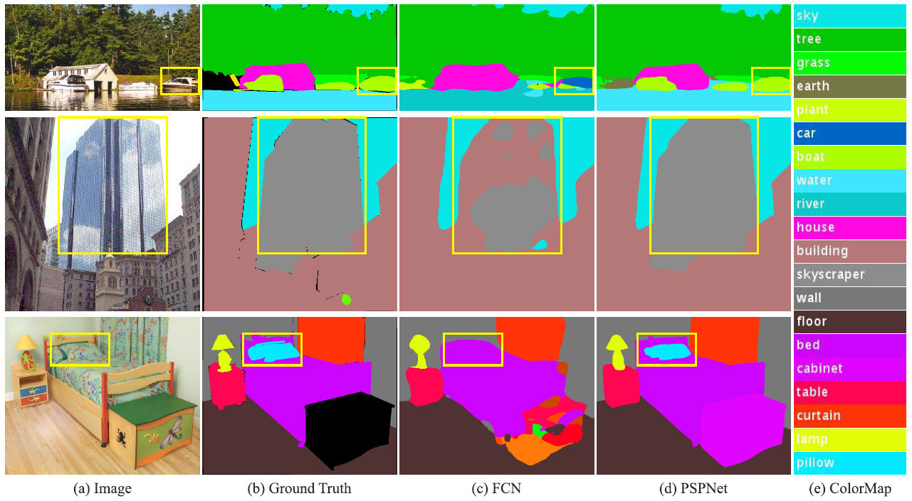
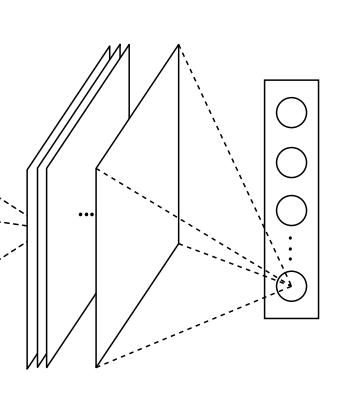
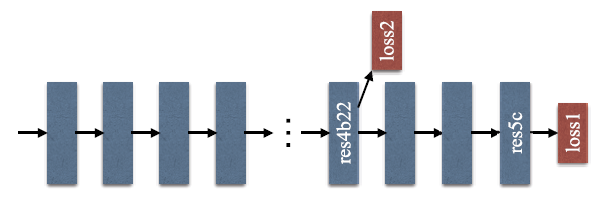
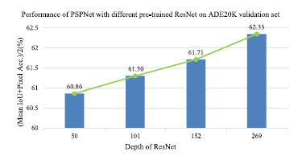
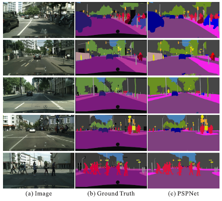

# Pyramid Scene Parsing Network [English]

한국어로 쓰인 리뷰를 읽으려면 [**여기**](cvpr-2017-pspnet-kor.md)를 누르세요.

## 1. Problem definition

Semantic segmentation is to know the category label of each pixels for known objects only. Scene parsing, which is based on semantic segmentation, is to know the category label of ALL pixels within the image. This is how these to tasks differ. Scene parsing provides complete understanding of the scene, where semantic segmentation only provides the category label of *known* objects. From scene parsing, one could further predict location as well as shape of each element. 

Mathematically explained, for input RGB image $$I^{\{W\times H\times 3\}}$$, the model predicts probability map $$P^{\{W\times H\times C\}}$$ where $$C$$ denotes the number of classes to predict. Each pixel values are the probability for each classes, and $$I'^{\{W\times H\}}=\argmax(P^{\{W\times H\times C\}})$$ can be used to predict the final class for each pixel.

## 2. Motivation

Prior to PSPNet, state-of-the-art scene parsing frameworks are mostly based on the fully convolutional network (FCN). However, FCN still faces challenges considering diverse scenes. 

Let's have a look at Fig. 1.

**Mismatched Relationship**  As shown in the first row of Fig. 1, FCN predicts the boat in the yellow box as a car based on its appearance only. This is because of its shape and appearance. But we all know that the car cannot float on a river. Lack of contextual information increases the chance of misclassification. If the network could get information about the context, say water around the object *boat,* it will correctly classify.

**Confusion Categories**  The second row shows confusion case where class building is easily confused as skyscraper. They are with similar appearances. This should be excluded so that the whole object is either skyscraper or building. 

**Inconspicuous Classes**  Scene contains objects/stuff of arbitrary size. Small objects are hard to find while they might be critical to detect, such as traffic light and signboard. On the other hand, big objects are tend to exceed the receptive field of FCN and cause discontinuous prediction. As shown in the third row, the pillow has similar appearance with the sheet. Overlooking the global scene category may fail to parse the pillow.

To summarize above observations, many errors are related to contextual relationship of the scene and global information for different receptive fields. 

### Related work

Thanks to **Fully Convolutional Network for Semantic Segmentation[3]**, scene parsing and semantic segmentation achieve great progress inspired by replacing the fully-connected layer in classification. However, the major issue for FCN based models is lack of suitable strategy to utilize global scene category clues as shown in the first row of Fig. 1.

To enlarge the receptive field of neural networks, **Multi-Scale Context Aggregation by Dilated Convolutions[4]** used dilated convolution which helps in increasing the receptive field. This dilated convolution layers are placed in the last two blocks of the backbone of proposed network. Figure 2. show how dilated convolution works differently from convolutions. We can see that the receptive field for dilated convolution is larger as compared to the standard convolution, hence much more context information.

 

**Semantic Image Segmentation with Deep Convolutional Nets and Fully Connected CRFs[5]** used conditional random field (CRF) as post processing to refine the segmentation result. This improves the localization ability of scene parsing where predicted semantic boundary fits objects. But there is still much room to exploit necessary information in complex scenes.

**ParseNet[6]** proved that global average pooling with FCN improve semantic segmentation results. The idea is to generate one feature map for each corresponding category of the classification task in the last layer, as shown in Fig. 3. However, the experiments in this paper show that these global descriptors are not representative enough for the challenging ADE20K data.

Spatial pyramid pooling was widely used where spatial statistics provide a good descriptor for overall scene interpretation. **Spatial Pyramid Pooling network[7]** further enhances the ability. In order to feed certain size of feature map into fully connected layer, fixed size of images was used as input to convolutional layer. In other words, input images were cropped and warped to produce fixed size of images, which leads to a huge loss of spatial and global information of images. In [7], spatial pyramid pooling was used before fully connected layer so that prior convolutional layer can take any size of input images, thus providing full context information of images.

### Idea

This paper uses FCN with dilated convolution so that the network has larger receptive field for more context information. This dilated convolution layers are placed in the last two blocks of the backbone. Hence the feature received at the end of the backbone contains richer features. 

Global average pooling is a good baseline model as the global contextual prior. But this strategy is not enough to cover necessary information in complex-scene images, where pixels are annotated regarding many stuff and objects. Directly fusing them to form a single vector may lose the spatial relationship and cause ambiguity. Global context information along with sub-region context is helpful in this regard to distinguish among various categories. To this end, different fro global pooling, this paper exploit the capability of global context information by different-region-based context aggregation via our pyramid scene parsing network.

In **Spatial Pyramid Pooling network[7]**, feature maps in different levels generated by pyramid pooling were finally flattened and concatenated to be fed into a fully connected layer for classification. To further enhance context information between different sub-regions, this paper proposes a hierarchical global prior, containing information with different scales and varying among different sub-regions.

## 3. Method

Overview of proposed PSPNet is shown in Fig. 4. First, given the input image (a), the network uses CNN to get the feature map of the last convolutional layer (b). Here PSPNet uses a pretrained ResNet model with the dilated network strategy to extract the feature map. The final feature map size is 1/8 of the input image. Then a pyramid parsing module is applied to get different sub-region representations, followed by upsampling and concatenation layers to form the final feature representation, which carries both local and global context information in (c). Finally, the convolution is applied to this feature representation to get the final pixel-wise prediction (d).

### 3.1. Pyramid Pooling Module

The pyramid pooling module fuses features extracted by CNN under four different pyramid scales. The coarsest level highlighted in red is global pooling to generate a single bin output, just like global average pooling. The following level divides the feature map into 4 sub-region and forms $$2\times2$$ pooled representation, as highlighted in yellow. The following levels form $$3\times3$$, $$6\times6$$ pooling respectively. In this paper, pyramid pooling module is one with bin sized of $$1\times1$$, $$2\times2$$, $$3\times3$$ and $$6\times6$$. For the type of pooling operation between max and average, experiments in Section 4. show the difference. To maintain the weight of global feature, $$1\times1$$ convolution is applied to each pyramid level to reduce the dimension by $$1/N$$, where $$N$$ is the level size of pyramid. Then upsample with bilinear interpolation is applied to the low-dimension feature maps to get the same size feature map as the original feature map. Finally, different levels of features are concatenated as the final pyramid pooling global feature.

### 3.2. Network Architecture

Given an input image in Fig. 4(a), pretrained ResNet model with dilated network strategy is used to extract the feature map. The size of extracted feature map is $$1/8$$ of the input image. Then the pyramid pooling module is added after as described in Section 3.1. to gather global context information. Using 4-level pyramid, the pooling kernels can cover the whole, half of, and some parts of the scene image. Then these global prior kernels are concatenated with the original feature map to form the whole feature with global context information. Finally a convolution layer is applied to generate the final prediction map.

### 3.3. Deep Supervision for ResNet-Based FCN

Increasing depth of network may introduce additional optimization difficulty. As in [9], to promote learning for each module layer, some small networks were attached to output of that module. This network typically has a couple of convolutional layers followed by fully connected layers that produce final classification prediction. In PSPNet, decoding part composed of pyramid pooling and upsampling is used to output final pixel-level prediction in the sub-module of backbone. Apart from the main branch using softmax loss to train the final classifier, this additional classifier is applied after the fourth stage. An example of this deeply supervised ResNet101 model is illustrated in Fig. 5. This auxiliary loss helps optimize the learning process, while the master branch loss takes the most responsibility.

## 4. Experiment & Result

### Experimental Setup

### 4.1. Implementation Details

Inspired by **DeepLab[8]** PSPNet uses the "poly" learning rate policy, described as $$lr=base\_lr(1-{iter\over maxiter})^{power}$$. Here, base learning rate is set to $$0.01$$ and $$power$$ to $$0.9$$. Momentum and weight decay are set to $$0.9$$ and $$0.0001$$ respectively. For data augmentation, random mirror and random resize between 0.5 and 2, random rotation between $$-10$$ and $$10$$ degrees, and random Gaussian blur for ImageNet and PASCAL VOC are applied. PSPNet contains dilated convolution following **DeepLab[8]**. Batchsize of $$16$$ is used and for the auxiliary loss, the weight is set to $$0.4$$ in experiments.

### 4.2. ImageNet Scene Parsing Challenge 2016

The ADE20K dataset is used in ImageNet scene parsing challenge 2016. ADE20K is challenging for the up to 150 classes and diverse scenes with a total of 1,038 image-level labels. For evaluation, both pixel-wise accuracy (Pixel Acc.) and mean of class-wise intersection over union (Mean IoU) are used.

| Method                	| Mean IoU(%) 	| Pixel Acc.(%) 	|
|-----------------------	|:-----------:	|:-------------:	|
| ResNet50-Baseline     	| 37.23       	| 78.01         	|
| ResNet50+B1+MAX       	| 39.94       	| 79.46         	|
| ResNet50+B1+AVE       	| 40.07       	| 79.52         	|
| ResNet50+B1236+MAX    	| 40.18       	| 79.45         	|
| ResNet50+B1236+AVE    	| 41.07       	| 79.97         	|
| ResNet50+B1236+MAX+DR 	| 40.87       	| 79.61         	|
| ResNet50+B1236+AVE+DR 	| **41.68**       	| **80.04**         	|

*Table 1. Baseline is ResNet50-based FCN with dilated network. 'B1' and 'B1236' denote pooled feature maps of bin sizes $$\{1\times 1\}$$ and $$\{1\times 1,2\times 2,3\times 3,6\times6\}$$ respectively. MAX represent max pooling, AVE average pooling, and DR dimension reduction with $$1\times 1$$ convolution after pooling. The results are tested on the validation set with the single-scale input.*

### Result

**Ablation Study for Pooling**  To evaluate PSPNet, the author conduct experiments with several settings, including pooling types of max and average, pooling with just one global feature or four-level features, with and without dimension reduction after the polling operation and before concatenation. As listed in Table 1, in terms of pooling, average works better. Pooling with four-level features outperforms that with global feature. The best setting is four-level pyramid of average pooling, followed by dimension reduction with $$1\times1$$ convolution. 

| Loss Weight α | Mean IoU(%) | Pixel Acc.(%) |
|:-----------------------------------------	|:-----------:	|:-------------:	|
| ResNet50 (without AL) | 35.82 | 77.07 |
| ResNet50 (with α = 0.3) | 37.01 | 77.87 |
| ResNet50 (with α = 0.4) | **37.23** | **78.01** |
| ResNet50 (with α = 0.6) | 37.09 | 77.84 |
| ResNet50 (with α = 0.9) | 36.99 | 77.87 |

*Table 2. Performance with various auxiliary loss weight.*

**Ablation Study for Auxiliary Loss**  The auxiliary loss helps optimize the learning process while not influencing learning in the master branch. Table 2. shows experiment result with different settings of auxiliary loss weight $$\alpha$$ and $$\alpha=0.4$$ yields the best performance. 

| Method | Mean IoU(%) | Pixel Acc.(%) 	|
|:-----------|------------|-----------	|
| PSPNet(50) | 41.68 | 80.04           	|
| PSPNet(101) | 41.96 | 80.64          	|
| PSPNet(152) | 42.62 | 80.80          	|
| PSPNet(269) | **43.81** | **80.88**          	|
| PSPNet(50)+MS | 42.78 | 80.76        	|
| PSPNet(101)+MS | 43.29 | 81.39       	|
| PSPNet(152)+MS | 43.51 | 81.38       	|
| PSPNet(269)+MS | **44.94** | **81.69**       	|

*Table 3. Deeper pre-trained model gets higher performance.*

**Ablation Study for Pre-trained Model**  To further analyze PSPNet, experiments for different depths of pre-trained ResNet have been conducted. As shown in Fig. 6, deeper pre-trained model get higher performance. The multi-scale testing helps to improve the results as well, listed in Table 3. 

| Method| Mean IoU(%) |Pixel Acc.(%)   	|
|:------|-------------|-----------------	|
| FCN | 29.39| 71.32               	|
| SegNet | 21.64| 71.00             	|
| DilatedNet | 32.31| 73.55        	|
| CascadeNet | 34.90| 74.52        	|
| ResNet50-Baseline | 34.28 | 76.35      	|
| ResNet50+DA | 35.82 | 77.07            	|
| ResNet50+DA+AL | 37.23 | 78.01         	|
| ResNet50+DA+AL+PSP | **41.68** | **80.04**     	|
| ResNet269+DA+AL+PSP | 43.81 | 80.88    	|
| ResNet269+DA+AL+PSP+MS | **44.94** | **81.69** 	|

*Table 4. 'DA' refers to data augmentation, 'AL' denotes the auxiliary loss.*

More Detailed Performance Analysis  Table 4. shows more detailed analysis on the validation set of ADE20K. The baseline is adapted from ResNet50 with dilated network. "ResNet269+DA+AL+PSP+MS" achieves highest performance among them.

| Method | aero | bike| bird| boat| bottle| bus| car| cat| chair| cow |table |dog |horse| mbike| person |plant |sheep |sofa |train |tv |mIoU     	|
|:--------|------|-----|-----|-----|-------|----|----|----|------|-----|------|----|-----|------|--------|------|------|-----|------|---|-------	|
| FCN|  76.8| 34.2| 68.9| 49.4| 60.3| 75.3| 74.7| 77.6| 21.4| 62.5 |46.8| 71.8| 63.9| 76.5| 73.9| 45.2| 72.4| 37.4| 70.9 |55.1| 62.2       	|
| Zoom-out | 85.6| 37.3| 83.2| 62.5 |66.0| 85.1 |80.7| 84.9| 27.2 |73.2 |57.5 |78.1 |79.2 |81.1 |77.1| 53.6 |74.0 |49.2| 71.7 |63.3| 69.6  	|
| DeepLab  |84.4| 54.5| 81.5| 63.6| 65.9| 85.1| 79.1| 83.4| 30.7| 74.1| 59.8| 79.0| 76.1| 83.2| 80.8| 59.7| 82.2| 50.4| 73.1| 63.7| 71.6    	|
| CRF-RNN | 87.5| 39.0| 79.7| 64.2| 68.3| 87.6| 80.8| 84.4| 30.4| 78.2| 60.4| 80.5| 77.8| 83.1| 80.6| 59.5| 82.8| 47.8| 78.3 |67.1 |72.0   	|
| DeconvNet|  89.9| 39.3| 79.7| 63.9| 68.2| 87.4| 81.2| 86.1| 28.5| 77.0| 62.0| 79.0| 80.3| 83.6| 80.2| 58.8| 83.4| 54.3| 80.7| 65.0| 72.5 	|
| GCRF|  85.2| 43.9| 83.3| 65.2| 68.3| 89.0| 82.7| 85.3| 31.1| 79.5| 63.3| 80.5| 79.3| 85.5| 81.0| 60.5| 85.5| 52.0| 77.3| 65.1| 73.2      	|
| DPN | 87.7| 59.4| 78.4| 64.9| 70.3| 89.3| 83.5| 86.1| 31.7| 79.9| 62.6| 81.9| 80.0| 83.5| 82.3| 60.5| 83.2| 53.4| 77.9| 65.0| 74.1       	|
| Piecewise | 90.6 |37.6| 80.0| 67.8| 74.4| 92.0| 85.2| 86.2| 39.1 |81.2| 58.9| 83.8| 83.9| 84.3| 84.8| 62.1| 83.2| 58.2| 80.8| 72.3| 75.3 	|
| PSPNet| **91.8**| **71.9**| **94.7**| **71.2**| **75.8**| **95.2**| **89.9**| **95.9**| **39.3**| **90.7**| **71.7**| **90.5**| **94.5**| **88.8**| **89.6**| **72.8**| **89.6**| **64.0**| **85.1**| **76.3**| **82.6**         	|
| CRF-RNN†  |  90.4| 55.3| 88.7| 68.4| 69.8| 88.3| 82.4| 85.1| 32.6| 78.5| 64.4| 79.6| 81.9| 86.4| 81.8| 58.6| 82.4| 53.5| 77.4| 70.1| 74.7           	|
| BoxSup†|  89.8| 38.0| 89.2| 68.9| 68.0| 89.6| 83.0| 87.7| 34.4| 83.6| 67.1| 81.5| 83.7| 85.2| 83.5| 58.6| 84.9| 55.8| 81.2| 70.7| 75.2            	|
| Dilation8†|  91.7| 39.6| 87.8| 63.1| 71.8| 89.7| 82.9| 89.8| 37.2| 84.0| 63.0| 83.3| 89.0| 83.8| 85.1| 56.8| 87.6| 56.0| 80.2| 64.7| 75.3           	|
| DPN†|  89.0| 61.6| 87.7| 66.8| 74.7| 91.2| 84.3| 87.6| 36.5| 86.3| 66.1| 84.4| 87.8| 85.6| 85.4| 63.6| 87.3| 61.3| 79.4| 66.4| 77.5           	|
| Piecewise†|  94.1| 40.7| 84.1| 67.8| 75.9| 93.4| 84.3| 88.4| 42.5| 86.4| 64.7| 85.4| 89.0| 85.8| 86.0| 67.5| 90.2| 63.8| 80.9| 73.0| 78.0           	|
| FCRNs†|  91.9| 48.1| 93.4| 69.3| 75.5| 94.2| 87.5| 92.8| 36.7| 86.9| 65.2| 89.1| 90.2| 86.5| 87.2| 64.6| 90.1| 59.7| 85.5| 72.7| 79.1           	|
| LRR†|  92.4| 45.1| 94.6| 65.2| 75.8| **95.1**| 89.1| 92.3| 39.0| 85.7| 70.4| 88.6| 89.4| 88.6| 86.6| 65.8| 86.2| 57.4| 85.7| 77.3| 79.3            	|
| DeepLab†|  92.6| 60.4| 91.6| 63.4| 76.3| 95.0| 88.4| 92.6| 32.7| 88.5| 67.6| 89.6| 92.1| 87.0| 87.4| 63.3| 88.3| 60.0| 86.8| 74.5| 79.7            	|
| PSPNet†| **95.8**| **72.7**| **95.0**| **78.9**| **84.4**| 94**| **92.0**| **95.7**| **43.1**| **91.0**| **80.3**| **91.3**| **96.3**| **92.3**| **90.1**| **71.5**| **94.4**| **66.9**| **88.8**| **82.0**| **85.4**        	|

*Table 5. Per-class results on PASCAL VOC 2012 testing set. Methods pre-trained on MS-COCO are marked with '$$\dag$$'.*

Table 5. shows results compared to previous best-performing methods on the PASCAL VOC 2012 dataset, with or without pre-training on MS-COCO dataset. PSPNet outperforms prior methods on both settings, especially getting the highest accuracy on all 20 classes without pre-trained. Several examples are shown in Fig. 7. The baseline model treats "cows" in first row as "horse" and "dog" while PSPNet corrects these errors. For "aeroplane" and "table" in the second and third row, PSPNet finds missing parts. For "person", "bottle" and "plant" in following rows, PSPNet performs well on these small-size object classes in the images compared to the baseline model.

| Method | IoU cla.| iIoU cla.| IoU cat.| iIoU cat. 	|
|---------|---------|---------|---------|----------	|
| CRF-RNN | 62.5| 34.4| 82.7| 66.0             	|
| FCN | 65.3| 41.7| 85.7| 70.1                 	|
| SiCNN | 66.3| 44.9| 85.0| 71.2               	|
| DPN | 66.8| 39.1| 86.0| 69.1                 	|
| Dilation10 | 67.1| 42.0| 86.5| 71.1          	|
| LRR | 69.7| 48.0| 88.2| 74.7                  	|
| DeepLab | 70.4| 42.6| 86.4| 67.7              	|
| Piecewise | 71.6| 51.7| 87.3| 74.1           	|
| PSPNet| **78.4**| **56.7**| **90.6**| **78.6**                   	|
| LRR‡| 71.8| 47.9| 88.4| 73.9                      	|
| PSPNet‡| **80.2**| **58.1**| **90.6**| **78.2**                  	|

*Table 6. Results on Cityscapes testing sets.*

Cityscapes is dataset for semantic urban scene understanding with 19 categories. Also, 20,000 coarsely annotated images are provided for two settings in comparison, that is training with only fine data or with both the fine and coarse data. Methods trained using both fine and coarse data are marked with '$$\ddag$$'. Here the base model is ResNet101 as in DeepLab[4] for fair comparison. Table 6. show that PSPNet outperforms other methods with significant advantage. Several examples are shown in Fig. 8.

## 5. Conclusion

This paper's main contributions are threefold:

- Proposes a pyramid scene parsing network to embed difficult scenery context features in an FCN based pixel prediction framework.
- Develops an effective optimization strategy for deep ResNet based on deeply supervised loss (auxiliary loss).
- Builds a practival system for state-of-the-art scene parsing and semantic segmentation with all crucial implementation details included.

Several experiments on different datasets show that PSPNet achieves the state-of-the-art performance compared to contemporary methods. However, PSPNet itself is just an encoder, which means it is just half of what is required for image segmentation. Future work could include working on decoder that is suitable for pyramid pooling module.

### Take home message (오늘의 교훈)

> This paper emphasizes the importance of global scene context for image segmentation.
> 

## Author / Reviewer information

### Author

**신주엽 (Juyeb Shin)**

- KAIST
- Research interest in computer vision, especially semantic visual SLAM
- [juyebshin.notion.site](http://juyebshin.notion.site)

### Reviewer

1. Korean name (English name): Affiliation / Contact information
2. Korean name (English name): Affiliation / Contact information
3. …

## Reference & Additional materials

1. H. Zhao, J. Shi, X. Qi, X. Wang and J. Jia, "Pyramid Scene Parsing Network," 2017 IEEE Conference on Computer Vision and Pattern Recognition (CVPR), 2017, pp. 6230-6239, doi: 10.1109/CVPR.2017.660.
2. [Official GitHub repository](https://github.com/hszhao/PSPNet)
3. J. Long, E. Shelhamer, and T. Darrell. Fully convolutional networks for semantic segmentation. In CVPR, 2015.
4. F. Yu and V. Koltun. Multi-scale context aggregation by dilated convolutions. arXiv:1511.07122, 2015.
5. L. Chen, G. Papandreou, I. Kokkinos, K. Murphy, and A. L. Yuille. Semantic image segmentation with deep convolutional nets and fully connected crfs. arXiv:1412.7062, 2014.
6. W. Liu, A. Rabinovich, and A. C. Berg. Parsenet: Looking wider to see better. arXiv:1506.04579, 2015.
7. K. He, X. Zhang, S. Ren, and J. Sun. Spatial pyramid pooling in deep convolutional networks for visual recognition. In ECCV, 2014. 
8. L. Chen, G. Papandreou, I. Kokkinos, K. Murphy, and A. L. Yuille. Deeplab: Semantic image segmentation with deep convolutional nets, atrous convolution, and fully connected crfs. arXiv:1606.00915, 2016
9. C. Szegedy et al., "Going deeper with convolutions," 2015 IEEE Conference on Computer Vision and Pattern Recognition (CVPR), 2015, pp. 1-9, doi: 10.1109/CVPR.2015.7298594.
