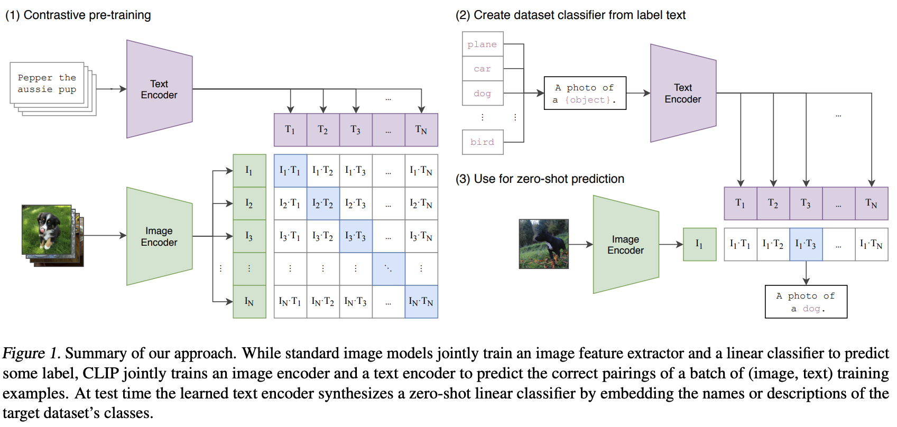
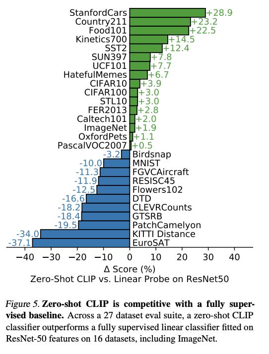
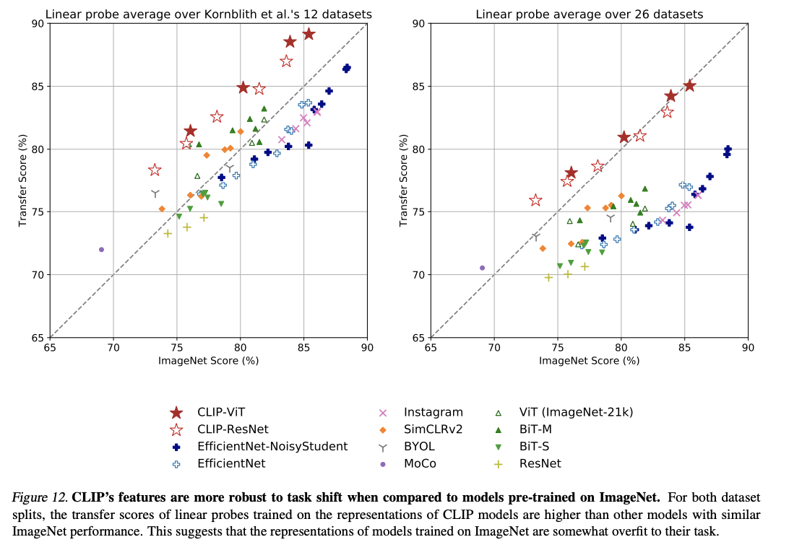

# \(Template\) Learning Transferable Visual Models From Natural Language Supervision \[ENG\]

### Learning Transferable Visual Models From Natural Language Supervision \[ENG\]
Radford and Kim et al. / Learning Transferable Visual Models From Natural Language Supervision / ICML 2021

한국어로 쓰인 리뷰를 읽으려면 [**여기**](paper-review/2021-fall-paper-review/icml-2021-CLIP-kor.md)를 누르세요.

##  1. Problem definition

Recent work in NLP enabled task-agnostic architectures to zero-shot transfer to downstream datasets. Without the need for specialized output head or dataset-specific customization, the results were reasonable compared to the results of task-specific models. However, in computer vision, it is still standard to pre-train models on crowd-labeled datasets such as ImageNet. Starting from the question, "Could scalable pre-training methods which learn directly from web text result in a similar breakthrough in computer vision?", the authors tried on building a model that can learn directly from a raw text about images. It leverages a much broader source of supervision and enables the usage of a dataset on the web. The paper demonstrates a model trained by a simple pre-training task called CLIP, short for Contrastive Learning-Image Pre-training, and shows that zero-shot transfer of the model to a downstream task is able and shows competitive results compared to a fully supervised baseline. 

## 2. Motivation


### Related work
There has been a long study on how to retrieve the content-based image by training the image-text pairs. 
* (Mori et al.) trained a model to predict the nouns and adjectives in text documents paired with images.
* (Quattoni et al.) used manifold learning in the weight space of classifiers trained to predict words in captions associated with images.
* (Srivastava & Salakhutdinov) trained multimodel Deep Boltzmann Machines on top of low-level image and text tag features to explore deep representation learning.
* (Joulin et al.) demonstrate that CNNs trained to predict words in image captions learn useful image representations.
* (Li et al.) extended the approach to predicting phrase n-grams in addition to individual words and demonstrate the model's ability on zero-shot transfer. 
* (Desai & Johnson), (Bulent Sariyidiz et al.), (Zhang et al.) showed the potential of transformer-based language modeling, masked language modeling, and contrastive objectives to learn image representations from the text.  
Though there was a long study and diverse papers about the topic, due to low accuracy, using natural language supervision for image representation learning was rare. Also, generalizing the case to zero-shot transfer has not been investigated largely in computer vision. This work has meaning in that it used natural language supervision and from the benefits, it could result in comparable zero-shot score with strong supervised models.


### Idea
The core idea of the paper is to learn perception from supervision contained in the natural language. In other words, to learn from the natural language supervision rather than strongly supervised labels from the humans. By doing so, it becomes much easier to scale up compared to standard crowd-sourced labeling since natural language supervision does not require annotations to the *gold label*. Also, it doesn't just learn a representation but can also connect the representations from the text and the image which enables flexible zero-shot transfer. 
In contrast to the previous zero-shot transfer in computer vision where it usually referred to *the study of generalizing to unseen object categories in the image classification*, this paper used the term as a way of *measuring the task learning capabilities of machine learning system*, which is a broader definition. By the corresponding definition, the authors suggest that a high score of zero-shot transfer indicates that the model is robust to distribution shift and domain generalization rather than task generalization. The paper shows the result of CLIP in zero-shot transfer and its robustness compared to the fully supervised baseline.

## 3. Method

### Dataset
To study the behaviors of image classifiers trained with natural language supervision at a large scale, the authors build a new dataset, WIT which is short for WebImageText from a variety of publicly available sources on the Internet. WIT consists of 400 million image and text pairs. This dataset is used for pre-training CLIP.

### Pre-train Method

The model is pre-trained from scratch with a contrastive objective. As shown on the left side of the image, when given a batch of N text-image pairs, CLIP extracts text embedding and image embedding from the corresponding encoder and is trained to find the most likely N pairs from the NxN combinations. It tries to minimize the cosine similarity of well-paired N text-image pairs and maximize the score for wrong NxN - N pairs and optimize symmetric cross-entropy loss over the similarity score. By the corresponding objective, CLIP learns a multi-modal embedding space by jointly training the image and text encoder. 

### Zero-shot transfer
With the text and image encoder trained, CLIP performs zero-shot in the test time as shown on the right side of the image. It first computes the feature embedding of the image and feature embedding of the set of possible texts from the trained encoder. By calculating the cosine similarity of the embeddings by a temperature parameter and normalizing them into a probability distribution by softmax, it can predict the correct label for the image.

### Image Encoder Model: ResNet & ViT
The author used two different architectures for the image encoder: ResNet-50 and ViT. From the ResNet-50 which is widely used, they made several modifications using ResNet-D improvements and antialiased rect-2 blur pooling, and replacing the global average pooling layer with an attention pooling mechanism. The second architecture ViT, which is short for Vision Transformer, was used in the same architecture with minor modification of adding an additional layer normalization to the combined patch and position embeddings before the transformer and used a slightly different initialization scheme. 

### Text Encoder Model: Transformer
For the text encoder model, the authors used Transformer with slight modification as GPT2. The base size of the model is 63M parameter, 12-layer, 512-wide model with 8 attention heads. It used lower-cased byte pair encoding (BPE) representation of the text with 49,152 vocabulary sizes. The max sequence length is capped at 76. Special tokens, [SOS] and [EOS], are added in front and the back of the sequence respectively. They used the activations of the highest layer of the transformer at the [EOS] token as the feature representation of the text after the layer normalizes and linearly project the activations into the multi-modal embedding space.

### Prompt Engineering and Ensembling


As shown in ***Figure 4***, the authors could boost the zero-shot classification performance by almost 5 points on average across 36 datasets when they used prompt engineering and ensembling. The authors thought of the idea due to some issues with the datasets. First, the vast majority of datasets annotate images with just the numeric id of the label and contain a file mapping these ids back to their names in English. Some datasets didn't have the mapping but rather just used the numeric id as the label. These were not suitable for cases of CLIP where the natural language of the label was necessary. The second issue is polysemy. There were some cases where the same work in the same dataset mean different things. For example, in ImageNet, word cranes could mean both construction cranes and cranes that fly. Last, there was an issue that the number of cases where a single word paired with the image was relatively low. Most of the text was a full sentence that describes the image in some way. To help bridge the gap, they used a prompt template as "A photo of a {label}." from which they could observe that similar to the prompt engineering in GPT3, they could improve the zero-shot performance significantly by customizing the prompt text to each task. The authors also experimented with ensembling over multiple zero-shot classifiers as another way of improving the performance. They constructed the ensemble over the embedding space instead of probability space which allowed them to cache a single set of averaged text embedding and reduce the computation cost. 

## 4. Experiment & Result

### Experimental Setup
The authors trained a series of 5 ResNet (ResNet-50, ResNet-101, 3 more which follow EfficientNet-Style model scaling of 4x, 16x, and 64x which is noted as RN50x4, RN50x16, and RN50x64 in the paper) and 3 Vision transformers (ViT-B/32, ViT-B/16, and ViT-L/14). The models are trained for 32 epochs with Adam optimizer with decoupled weight decay regularization applied to all weights that are not gains or biases, and decay the learning rate using a cosine schedule. Initial hyperparameters were set using a combination of grid searches, random search, and manual tuning on the baseline ResNett-50 model when trained for 1 epoch. The learnable temperature parameter for computing cosine similarity was initialized to 0.07 and clipped to prevent scaling the logits by more than 100. The size of the minibatch is 32,768 and used mixed-precision. 
The largest ResNet model, RN50x64 took 18 days to train on 592 V100 GPUs and the largest Vision Transformer model took 12 days on 256 V100 GPUs. The model that was used for the results in the paper is ***ViT-L/14@336px*** which the authors also pre-trained ViT-L/14 at a higher 336-pixel resolution for one additional epoch to boost performance.


### Result
The paper consists of a study of various properties of CLIP's zero-shot classifiers. First, they simply looked at how well zero-shot classifiers perform. To compare the performance, they made a baseline by fitting a fully supervised, regularized, logistic regression classifier on the features of the canonical ResNet-50 which they named *liner probe on ResNet50* in the paper. 



As in Figure 5, we can see that across 27 datasets, Zero-shot CLIP outperforms linear probe on ResNet50 on 16 datasets which is over half the number. The authors analyzed that zero-shot CLIP underperforms on several specialized, complex, or abstract tasks such as satellite image classification (EuroSAT, RESISC45), lymph node tumor detection (PatchCamelyon), etc. This result shows the poor capability of zero-shot CLIP on more complex tasks. 


The authors also compared the score of zero-shot and few-shot in Figure 6. We can find that zero-shot CLIP matches the performance of 4-shot logistic regression on the same feature space. This is because CLIP's zero-shot classifier is generated via natural language where visual concepts can be directly specified. Where few-shot linear probes have to infer concepts indirectly from the examples. The authors suggest initializing the model with a zero-shot checkpoint as one way of decreasing the discrepancy between the zero-shot and few-shot. 


When they compare the score of linear probe performance of CLIP models with the SOTA models in computer vision, we can see that CLIP-ViT outperforms the previous works. 




Also, they compared how robust CLIP is to task shift (figure 12) and distribution shift (figure 13). We can easily see from the two figures that CLIP is much more robust to both task and distribution shifts. These results suggest that the recent shift towards the large-scale task and dataset agnostic pre-training combined with a reorientation towards zero- and few-shot promotes the development of more robust systems and provides a more accurate assessment of performance. 
The authors also compared the CLIP with human performance and human learning. The results show that the hardest problems for CLIP are also hard for humans. They assume two reasons for such correlation: noise in the dataset and out of distribution.
They further analyzed CLIP on its limitation, dataset issues, and the broader impacts it could give.


## 5. Conclusion
From the question, "Could scalable pre-training methods which learn directly from web text result in a similar breakthrough in computer vision as it was done in NLP?", the authors tried to pre-train the model without strong annotation and directly from the natural text features. This allowed the model to learn a much broader source of supervision and become robust on different distributions. After pretraining CLIP in contrastive objective from scratch, the model was able to be used as zero-shot transfer in a downstream task. It showed competitive results with a fully supervised baseline without the need for any dataset-specific training which is a surprising result. There are an extensive analysis of the result and the model from the authors. 

### Take home message \(오늘의 교훈\)

* Recent shift towards the large-scale task and dataset agnostic pre-training combined with a reorientation towards zero- and few-shot promotes the development of more robust systems and provides a more accurate assessment of performance. 
* Task Agnostic models of computer vision are also able to show sufficient results without task-specific training as was done in NLP. 
* Natural language supervision gives much broader information than simple labels.

## Author / Reviewer information

### Author

**이현지 \(Hyunji Lee\)** 

* KAIST AI
* https://github.com/amy-hyunji
* hyunji.amy.lee@kaist.ac.kr

### Reviewer

1. Korean name \(English name\): Affiliation / Contact information
2. Korean name \(English name\): Affiliation / Contact information
3. ...

## Reference & Additional materials

* Citation of CLIP
   ```
   @inproceedings{Radford2021LearningTV,
    title={Learning Transferable Visual Models From Natural Language Supervision},
    author={Alec Radford and Jong Wook Kim and Chris Hallacy and Aditya Ramesh and Gabriel Goh and Sandhini Agarwal and Girish Sastry and Amanda Askell and Pamela Mishkin and Jack Clark and Gretchen Krueger and Ilya Sutskever},
    booktitle={ICML},
    year={2021}
   }
   ```
* [CLIP github link](https://github.com/OpenAI/CLIP)
* Citation of ViT
  ```
  @article{Dosovitskiy2021AnII,
  title={An Image is Worth 16x16 Words: Transformers for Image Recognition at Scale},
  author={Alexey Dosovitskiy and Lucas Beyer and Alexander Kolesnikov and Dirk Weissenborn and Xiaohua Zhai and Thomas Unterthiner and Mostafa Dehghani and Matthias Minderer and Georg Heigold and Sylvain Gelly and Jakob Uszkoreit and Neil Houlsby},
  journal={ArXiv},
  year={2021},
  volume={abs/2010.11929}
  }
  ```
* Citation of ResNet
  ```
  @article{He2016DeepRL,
  title={Deep Residual Learning for Image Recognition},
  author={Kaiming He and X. Zhang and Shaoqing Ren and Jian Sun},
  journal={2016 IEEE Conference on Computer Vision and Pattern Recognition (CVPR)},
  year={2016},
  pages={770-778}
  }
  ```
* Citation of Transformers
  ```
  @article{Vaswani2017AttentionIA,
  title={Attention is All you Need},
  author={Ashish Vaswani and Noam M. Shazeer and Niki Parmar and Jakob Uszkoreit and Llion Jones and Aidan N. Gomez and Lukasz Kaiser and Illia Polosukhin},
  journal={ArXiv},
  year={2017},
  volume={abs/1706.03762}
  }
  ```
* Citation of GPT2
  ```
  @inproceedings{Radford2019LanguageMA,
  title={Language Models are Unsupervised Multitask Learners},
  author={Alec Radford and Jeff Wu and Rewon Child and David Luan and Dario Amodei and Ilya Sutskever},
  year={2019}
  } 
  ```
* Citation of papers in Related Works
  ```
  @inproceedings{Mori1999ImagetowordTB,
  title={Image-to-word transformation based on dividing},
  author={Yasuhide Mori and Hironobu Takahashi and Ryu-ichi Oka},
  year={1999}
  }
  ```
  ```
  @article{Quattoni2007LearningVR,
  title={Learning Visual Representations using Images with Captions},
  author={Ariadna Quattoni and Michael Collins and Trevor Darrell},
  journal={2007 IEEE Conference on Computer Vision and Pattern Recognition},
  year={2007},
  pages={1-8}
  }
  ```
  ```
  @inproceedings{Srivastava2012MultimodalLW,
  title={Multimodal learning with deep Boltzmann machines},
  author={Nitish Srivastava and Ruslan Salakhutdinov},
  booktitle={J. Mach. Learn. Res.},
  year={2012}
  }
  ```
  ```
  @inproceedings{Joulin2016LearningVF,
  title={Learning Visual Features from Large Weakly Supervised Data},
  author={Armand Joulin and Laurens van der Maaten and A. Jabri and Nicolas Vasilache},
  booktitle={ECCV},
  year={2016}
  }
  ```
  ```
  @article{Li2017LearningVN,
  title={Learning Visual N-Grams from Web Data},
  author={Ang Li and A. Jabri and Armand Joulin and Laurens van der Maaten},
  journal={2017 IEEE International Conference on Computer Vision (ICCV)},
  year={2017},
  pages={4193-4202}
  }
  ```
  ```
  @inproceedings{Desai2021VirTexLV,
  title={VirTex: Learning Visual Representations from Textual Annotations},
  author={Karan Desai and Justin Johnson},
  booktitle={CVPR},
  year={2021}
  }
  ```
  ```
  @inproceedings{Sariyildiz2020LearningVR,
  title={Learning Visual Representations with Caption Annotations},
  author={Mert Bulent Sariyildiz and Julien Perez and Diane Larlus},
  booktitle={ECCV},
  year={2020}
  }
  ```
  ```
  @article{Zhang2020ContrastiveLO,
  title={Contrastive Learning of Medical Visual Representations from Paired Images and Text},
  author={Yuhao Zhang and Hang Jiang and Yasuhide Miura and Christopher D. Manning and C. Langlotz},
  journal={ArXiv},
  year={2020},
  volume={abs/2010.00747}
  }
  ```
