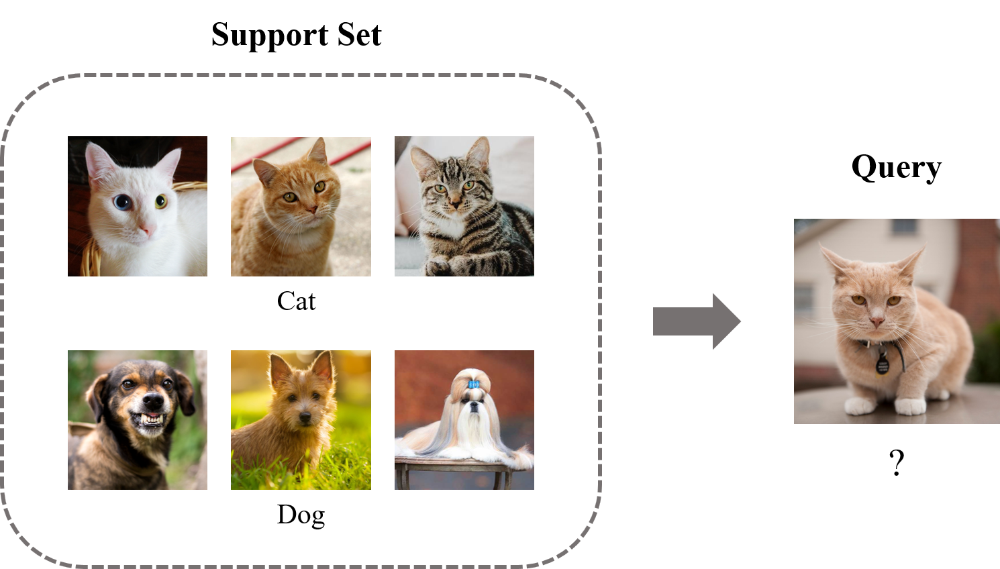

# Shot in the Dark: Few-Shot Learning with No Base-Class Labels \[Kor\]

##  1. Problem definition

본 논문에서는 **Few-Shot Learning (FSL)** 문제를 **Self-Supervised Learning (SSL)**로 해결했습니다. SSL에 관한 자세한 내용은 **2.Motivation [Related Work]**에서 다루기로 하고, 이 섹션에서는 FSL에 대해 알아보겠습니다.

보통 딥러닝은 아주 많은 수의 데이터를 필요로 합니다. 이미지 분류 문제의 대표적인 데이터셋인 ImageNet의 경우 천만 개가 넘는 데이터가 존재합니다.
반면 FSL은 말 그대로, 아주 적은 수의 데이터를 이용해 학습하는 문제입니다. 예를 들어, 고양이와 강아지 사진을 각각 3장씩만 보여준 후, 새로운 사진을 보여주고 해당 사진이 고양이인지, 강아지인지 분류하게 하는 문제가 있을 수 있습니다. (Figure1) 이 때, 모델에게 사전에 주어지는 적은 수의 데이터를 **Support Set**이라 하고, 문제로 주어지는, 답을 모르는 새로운 데이터를 **Query**라고 합니다. 꼭 classification 문제에만 국한되는 것이 아니라, segmentation이나 detection, 혹은 그 외의 문제가 될 수도 있습니다.

주어진 데이터셋의 class의 개수(K)와, 각 class에 속하는 샘플 수(N)에 따라 K-way N-shot 문제라고 불립니다. 예를 들어, Figure1의 경우 2-way 3-shot이라고 할 수 있습니다. 보통 성능 평가를 위해 주로 사용되는 task는 5-way 5-shot, 5-way 1shot입니다.

이렇게 극단적으로 적은 수의 데이터만을 가지고 딥러닝 모델을 학습시키는 것은 거의 불가능합니다. 따라서 FSL 문제를 풀기 위해서는 Meta-learning을 이용합니다. Meta-data가 "데이터에 대한 데이터"인 것처럼, Meta-learning은 "학습하는 법을 학습"하는 방법을 의미합니다.

![Figure2: Armadillo와 Pangolin을 구별하는 문제 [3]](../../.gitbook/assets/1/metalearning.PNG)

Figure 2는 Armadillo와 Pangolin의 사진을 각각 두 장씩 보여주고, 주어진 Query 사진이 Armadillo인지, Pangolin인지 맞추게 하는 2-way 2-shot 문제입니다. 이것을 사람의 입장에서 생각해보면, 우리는 이 두 동물에 대한 사전지식이 없더라도 문제를 맞출 수 있습니다. 네 장의 사진을 자세히 보면, Armadillo는 귀가 뾰족하고 몸통에 가로 줄무늬가 있는 반면, Pangolin은 비늘 같은 무늬가 있는 것을 알 수 있습니다. 우리가 이렇게 제한적인 정보만 가지고 두 동물을 구별할 수 있는 것은, 우리는 이미 그동안의 경험을 통해 "특징을 추출하는 방법"을 익혀왔기 때문입니다.

![Figure3: Training set, Support set, Query [3]](../../.gitbook/assets/1/trainingset.PNG)

Meta-learning은 이와 유사하게, 모델에게 "특징을 추출하는 능력"을 사전에 학습시키는 방식입니다. **Training Set**이라는 새로운 대량의 데이터가 등장합니다. 이를 통해 특징 추출 능력을 배우고, 이 지식을 이용해 Support Set의 아주 적은 수의 샘플들만을 가지고 Query의 문제를 풉니다. 물론, Training set의 class와 Support set의 class는 서로 달라야 합니다. Training set은 모델을 충분히 학습시킬 수 있을 만큼 큰 데이터셋이고, support set의 class가 여기에 속해 있으면 few-shot learning의 의미가 없어지기 때문입니다. 이 때 Training set의 class들을 **Base class**, Support set의 class들을 **Novel class**라고 합니다. FSL에 대한 보다 자세한 설명과 관련 연구들을 알고 싶으신 분들은 \[3\], \[4\], \[5\] 등을 추천드립니다.

## 2. Motivation

본 논문에서는 FSL 중 하나의 종류인 Transductive Few-Shot Learning (TFSL) 문제에 초점을 맞추고 있습니다. 앞에서 설명한 대로, FSL은 대량의 Training set을 에서 학습한 사전 지식에 크게 의존하는데, 만약 Training set과 Support set의 차이가 매우 크다면 문제가 생깁니다. 예를 들어, Figure3의 경우처럼 Training set이 ImageNet, Support set이 Armadillo/Pangolin 이미지라면 두 데이터셋의 class들이 크게 다르지 않아서 괜찮지만, 만약 Figure4처럼 Support set이 T1/T2 MRI라면 두 데이터셋이 매우 달라 Training set에서 학습한 지식을 제대로 활용할 수 없을 수도 있습니다. 

TFSL은 Training set과 Support set에 더해, Query set의 unlabeled 샘플들을 추가로 활용하는 방법입니다. Label이 있지만 수가 매우 적은 Support set에 비해, Query set은 label이 없지만 상대적으로 얻기가 쉽습니다. 여기서 얻을 수 있는 novel class의 distribution에 대한 추가적인 정보를 활용할 수 있을 것이라는 아이디어입니다. 따라서 TFSL은, Base class에 속하는 대량의 labeled 샘플 (Training set)에 추가로 Novel class에 속하는 대량의 Unlabeled 샘플을 활용할 수 있다고 가정하는 문제입니다. FSL의 unsupervised 버전이라고 생각하시면 될 것 같습니다.

TFSL에 대한 기존 연구들은, 높은 신뢰도로 분류된 Unlabeled novel 샘플들을 활용하거나\[6\], Unlabeled novel 샘플들을 사전 학습된 모델의 fine-tuning 단계에서의 regularizer로써 활용하는 등\[7\], **base class의 샘플들을 이용한 supervised learning으로부터 얻은 inductive bias를 개선시키는 데에만 머물러 있었습니다.** 본 논문에서는, **Self-Supervised Learning (SSL)을 이용해 Labeled sample들을 전혀 이용하지 않고, unlabeled sample들만을 이용하여 모델을 scratch부터 학습시킬 수 있는 방법을 제시합니다.**

### Related work

앞서 설명한 듯이 본 논문에서는 Self-Supervised Learning (SSL)을 이용합니다. 이 섹션에서는 SSL에 대해 간략히 설명하겠습니다. 보다 자세한 설명과 관련 연구들에 대한 설명은 \[8\], \[9\] 등을 추천드립니다.

SSL은 데이터-Label 쌍을 이용해 모델을 학습시키는 Supervised learning과 달리, Label 없이 데이터 자체만을 이용해 모델을 학습시키는 방법입니다. Label annotation은 많은 노력이 들어가기 때문에, 많은 분야에서 활용 가능성이 높은 기법입니다.

![Figure5: Overall process of SSL [9]](../../.gitbook/assets/1/ssl.png)

다양한 방법이 있지만, 공통적인 흐름은 다음과 같습니다. 우선, 연구자가 직접 정의한 **Pretext task**를 이용하여 label 없이 데이터만으로 모델을 학습시킵니다. Pretext task를 이용해 학습시킨 모델의 weight를 이용해 수행할 downstream task에 대한 transfer learning + fine tuning 과정을 거칩니다. 간단한 Pretext task의 예로는 denoising, colorization, zigsaw, context prediction 등이 있을 수 있습니다. 예를 들어, 이미지를 여러 개의 patch로 나눈 뒤, 각 patch가 어떤 위치에서 왔는지를 맞추는 Context prediction task를 설정할 수 있습니다. (Figure6) \[10\] 이 과정에서 모델이 이미지에서 특징을 추출하는 방법을 학습합니다. 각 task에 대한 자세한 설명은 앞에서 소개한 링크들에 잘 소개되어 있습니다.

![Figure6: Pretext task example - Context prediction [10]](../../.gitbook/assets/1/mri.PNG)

본 논문에서 사용한 SSL 기법은 최근 가장 좋은 성능을 보이고 있는 MoCo-v2 \[11\]입니다. MoCo-v2는 Kaiming He가 제안한 MoCo의 업그레이드 된 버전으로, 전체적인 동작 방식은 다음과 같습니다. 입력 이미지에 대해 random augmentation을 적용하고, 이를 입력 이미지에 대한 positive pair로 이용합니다. 입력 이미지가 아닌 다른 샘플들은 negative pair로 이용하여, positive pair 간의 similarity를 극대화하고, negative pair 간의 simimlarity는 최소화하는 방법입니다. Loss function은 다음과 같습니다. 여기에서 $q_i$는 입력 이미지에 대한 embedding vector을 의미하고, $k_i$, $k_j (j \neq i)$는 각각 positive pair, negative pair의 embedding vector입니다. 전체 수식은 positive pair 간의 similarity와 negative pair 간의 dissimilarity에 대한 Cross entropy loss라고 생각하시면 됩니다. MoCo에 대한 상세한 설명은 \[12\]의 게시물을 참고하시면 될 것 같습니다.

$$
L_{q_i} = -log(\frac{exp(q_i^Tk_i/\tau)}{exp(q_i^Tk_i/\tau)+\sum_{j\neq i}exp(q_i^Tk_j/\tau)})
$$

### Idea

본 논문은 MoCo-v2를 통해 Unlabeled sample들을 이용하여 모델을 학습시키는 방법을 이용했습니다. 이를 통해 모델은 보다 일반화된 representation을 학습할 수 있고, Labeled 샘플이 전혀 없는 제한된 상황에서도 기존 방식과 비슷하거나 더 높은 성능을 낼 수 있었다고 주장하고 있습니다.

## 3. Method


If you are writing **Author's note**, please share your know-how \(e.g., implementation details\)


The proposed method of the paper will be depicted in this section.

Please note that you can attach image files \(see Figure 1\).  
When you upload image files, please read [How to contribute?](../../how-to-contribute.md#image-file-upload) section.

We strongly recommend you to provide us a working example that describes how the proposed method works.  
Watch the professor's [lecture videos](https://www.youtube.com/playlist?list=PLODUp92zx-j8z76RaVka54d3cjTx00q2N) and see how the professor explains.

## 4. Experiment & Result


If you are writing **Author's note**, please share your know-how \(e.g., implementation details\)


This section should cover experimental setup and results.  
Please focus on how the authors of paper demonstrated the superiority / effectiveness of the proposed method.

Note that you can attach tables and images, but you don't need to deliver all materials included in the original paper.

### Experimental setup

This section should contain:

* Dataset
* Baselines
* Training setup
* Evaluation metric
* ...

### Result

Please summarize and interpret the experimental result in this subsection.

## 5. Conclusion

In conclusion, please sum up this article.  
You can summarize the contribution of the paper, list-up strength and limitation, or freely tell your opinion about the paper.

### Take home message \(오늘의 교훈\)

Please provide one-line \(or 2~3 lines\) message, which we can learn from this paper.

> All men are mortal.
>
> Socrates is a man.
>
> Therefore, Socrates is mortal.

## Author / Reviewer information


You don't need to provide the reviewer information at the draft submission stage.


### Author

**김보민 \(Bomin Kim\)** 

* KAIST, Bio and Brain Enginnering (Advisor: Sung-Hong Park)
* Interested in Medical image analysis, Deep learning, Computer vision
* Personal web page: https://bo-10000.tistory.com/

### Reviewer

1. Korean name \(English name\): Affiliation / Contact information
2. Korean name \(English name\): Affiliation / Contact information
3. ...

## Reference & Additional materials

1. **\[Original paper\]** Chen, Zitian, Subhransu Maji, and Erik Learned-Miller. "Shot in the dark: Few-shot learning with no base-class labels." Proceedings of the IEEE/CVF Conference on Computer Vision and Pattern Recognition. 2021.
2. **\[Autho's presentation video\]** https://www.youtube.com/watch?v=RqVPS9e3b9o
3. **\[FSL introduction\]** (Eng) Wang, S. (2020, August 21). Few-Shot Learning (1/3): Basic Concepts \[Video\]. YouTube. https://www.youtube.com/watch?v=hE7eGew4eeg
4. **\[FSL introduction\]** (Kor) 1.퓨샷 러닝(few-shot learning) 연구 동향을 소개합니다. (2019, November 6). Kakaobrain. https://www.kakaobrain.com/blog/106
5. **\[FSL introduction\]** (Kor) Few-shot Learning Survey. (2020, November 25). https://velog.io/@tobigs-gm1/Few-shot-Learning-Survey
6. **\[TFSL paper\]** Zitian Chen, Yanwei Fu, Kaiyu Chen, and Yu-Gang Jiang. Image block augmentation for one-shot learning. In Association for the Advancement of Artificial Intelligence (AAAI), volume 33, pages 3379–3386, 2019.
7. **\[TFSL paper\]** Guneet Singh Dhillon, Pratik Chaudhari, Avinash Ravichandran, and Stefano Soatto. A baseline for few-shot image classification. In Proceedings of the International Conference on Learning Representations (ICLR), 2019.
8. **\[SSL introduction\]** (Kor) Self-Supervised Learning(자기지도 학습 설명). (2020, November 01). https://greeksharifa.github.io/self-supervised%20learning/2020/11/01/Self-Supervised-Learning/
9. **\[SSL introduction\]** (Kor) Self-Supervised Learning. (2020, November 18). https://velog.io/@tobigs-gm1/Self-Supervised-Learning
10. **\[SSL paper\]** Doersch, Carl, Abhinav Gupta, and Alexei A. Efros. "Unsupervised visual representation learning by context prediction." Proceedings of the IEEE international conference on computer vision. 2015.
11. **\[MOCOv2 paper\]** Chen, Xinlei, et al. "Improved baselines with momentum contrastive learning." arXiv preprint arXiv:2003.04297 (2020).
12. **\[MoCo introduction\]** (Kor) Self-Supervised Learning - MoCO (1). (2021, April 15). https://hongl.tistory.com/122