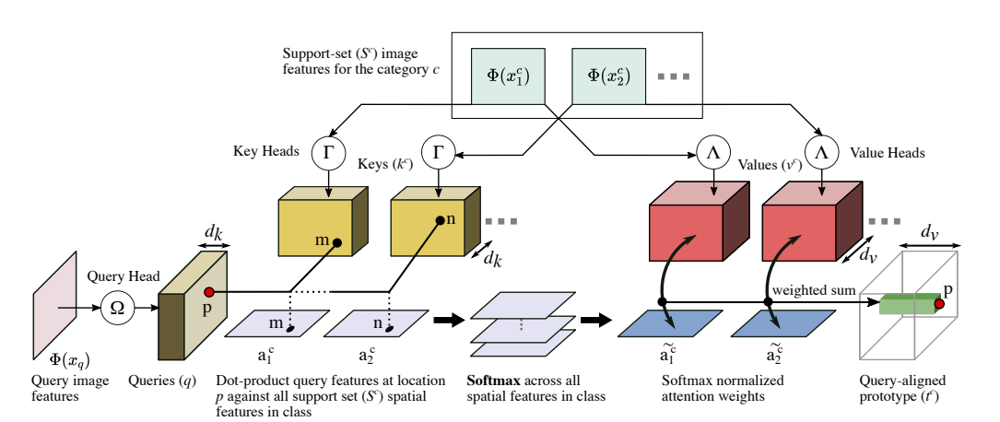

# CrossTransformer \[Kor\]

##  1. Problem definition

본 논문은 Transformer에 PrototypeNet을 결합한 few-shot learning을 다룹니다.

현재의 vision system은 소수의 데이터로 새로운 task를 부여하면, 그 성능이 현저히 저하됩니다. 
즉, 방대한 양의 데이터가 있을 때만 새로운 task를 성공적으로 수행할 수 있습니다. 
하지만 현실 세계에서 매번 방대한 양의 데이터를 학습하기는 어렵고, 그렇게 labelling된 데이터를 구하기도 어렵습니다.

예를 들어 보겠습니다.
Home Robot이 집에 새로운 물건이 들어왔는데, 이를 전혀 인식하지 못한다면 어떻게 될까요?
공장에서 assurance system이 새로운 제품에 대해 결함을 바로 인식하지 못한다면 또 어떨까요?
Home Robot과 assurance system을 다시 학습시켜야 하는데, 새로운 데이터라 학습이 어려울 것입니다. 

Vision System의 궁극적 목표는 새로운 환경, 즉 task에 곧바로 적용하는 것입니다. 
이에 저자들은 적은 양의 데이터로 model의 빠른 학습을 통해, 곧바로 새로운 data를 처리할 수 있도록 하는 것을 목표로 Transformer를 발전시켰습니다. 
즉, Transformer가 few-shot learning이 가능하도록 한 것입니다.
  

먼저, 저자들이 생각한 기존 few-shot learning의 문제점을 살펴보겠습니다. 

지금까지 few-shot learning은 meta-learning과 함께 연구되어 왔습니다. 
그리고 Prototypical Nets는 Meta-Dataset의 SOTA model 입니다. 
하지만 이 Prototypical Nets는 training-set의 image class만 represent하고 out-of-distribution classes, 즉 새로운 image class를 classify하는데 필요할 수 있는 정보는 버려버린다는 문제를 가지고 있습니다. 

아래의 그림을 보겠습니다.

<b>Figure 1: Illustration of supervision collapse with nearest neighbors</b>

  

이는 Prototypical Nets로 embedding시킨 후, Query 데이터 이미지에 따른 9개의 nearest neighbors를 도출한 결과입니다.
Nearest neighbor와 같이 간단한 classifier가 잘 작동하기 위해서는, 의미적으로 유사한 이미지 데이터들끼리 유사한 representation을 가지고 있어야 합니다.
하지만 위의 결과를 보면, 오직 5%만이 Query의 class와 일치합니다. 
게다가 training class에서 잘못 학습한 데이터들(붉은 박스)이 꽤 많다는 것입니다.

그렇다면 왜 이렇게 잘못 학습된 것일까요?

한 가지 유추할 수 있는 점은, network가 학습 도중 이미지 pattern을 각 class마다 feature space를 너무 강하게 grouping해 버린다는 것입니다. 
즉, 이미지가 다른 class의 이미지와도 유사할 수 있다는 점을 간과한 채 학습을 하는 것입니다. 
쉽게 말해 Figure 1에서 screw의 feature space와 buckeye의 feature space가 분명 다른 class지만 유사할 수 있다는 점을 무시한채 학습을 하여, 결국 test단계에서 유사한 feature space인 buckeye가 들어오면 screw로 분류해 버리는 classification 오류를 낳는다는 것입니다. 

특히 이는 out-of-domain samples에서 network가 착각하기 더 쉽습니다.
저자들은 이를 "overemphasize a spurious image pattern"이라고 표현합니다. 
Network가 오직 자신이 training한 데이터에 대한 유사 feature가 test data로 들어오면, 이를 학습한 데이터에서만 유사성을 찾다보니 과도하게 해석하여 training class 중 가장 유사한 것을 뱉어버린다는 것입니다.

결국 training class 안에서만 유사 feature space를 유추하여 잘못된 분류를 하는 문제가 발생합니다.
저자들은 이를 "Supervision Collapse"라고 하며, 정확한 class 분류를 위한 이미지 pattern학습을 하지 못했다는 것입니다.

## 2. Motivation

본 논문의 저자들은 supervision collapse문제를 해결하고자, SimCLR과 Prototypical Nets를 기반으로하는 CrossTransformer를 제안합니다. 

### Related work

1. Few-shot image classification

2. Attention for few-shot learning

3. correspondences for visual recognition

4. Self-supervised learning for few-shot

### Idea

After you introduce related work, please illustrate the main idea of the paper. It would be great if you describe the idea by comparing or analyzing the drawbacks of the previous work.

## 3. Method

<b>Figure 2: CrossTransformers</b>

<b>Figure 3: Visualization of the attention</b>

## 4. Experiment & Result

This section should cover experimental setup and results.  
Please focus on how the authors of paper demonstrated the superiority / effectiveness of the proposed method.

Note that you can attach tables and images, but you don't need to deliver all materials included in the original paper.

### Experimental setup

* Dataset: 아래 표(Figure 4, 5)의 x축을 참고해 주세요
* Baselines: 아래 표(Figure 5)의 y축을 참고해 주세요
* Training setup: 
* Evaluation metric: Accuracy

### Result

<b>Figure 4: Effects of architecture and SimCLR Episodes on Prototypical Nets, for Meta-Dataset Train-on-ILSVRC</b>

  

<b>Figure 5: CrossTransformers(CTX) comparison to state-of-the-art</b>

## 5. Conclusion

In conclusion, please sum up this article.  
You can summarize the contribution of the paper, list-up strength and limitation, or freely tell your opinion about the paper.

### Take home message \(오늘의 교훈\)

Please provide one-line \(or 2~3 lines\) message, which we can learn from this paper.

> All men are mortal.
>
> Socrates is a man.
>
> Therefore, Socrates is mortal.

## Author / Reviewer information

### Author

**성지현 \(Jihyeon Seong\)** 

* M.S. student in KAIST AI
* [Github](https://github.com/monouns)
* E-mail: tjdwltnsfP1@gmail.com / jihyeon.seong@kaist.ac.kr

### Reviewer

1. Korean name \(English name\): Affiliation / Contact information
2. Korean name \(English name\): Affiliation / Contact information
3. ...

## Reference & Additional materials

1. Carl Doersch, Ankush Gupta, Andrew Zisserman, "CrossTransformers: spatially-aware few-shot transfer", 2020 NeurIPS
2. [Official GitHub repository](https://github.com/google-research/meta-dataset)
3. [Unofficial Github repository with Pytorch](https://github.com/lucidrains/cross-transformers-pytorch)
4. Citation of related work
5. Other useful materials

