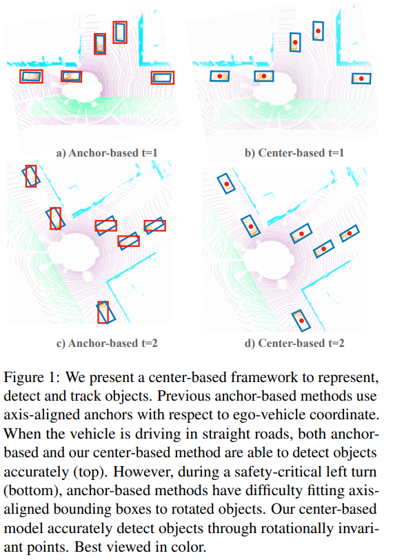
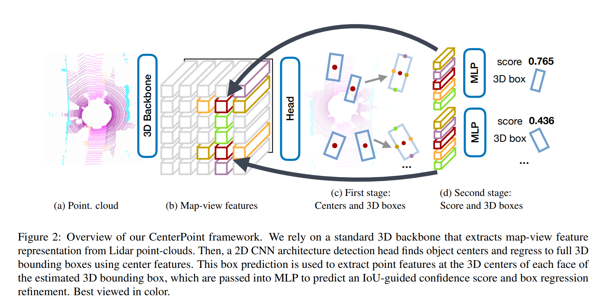
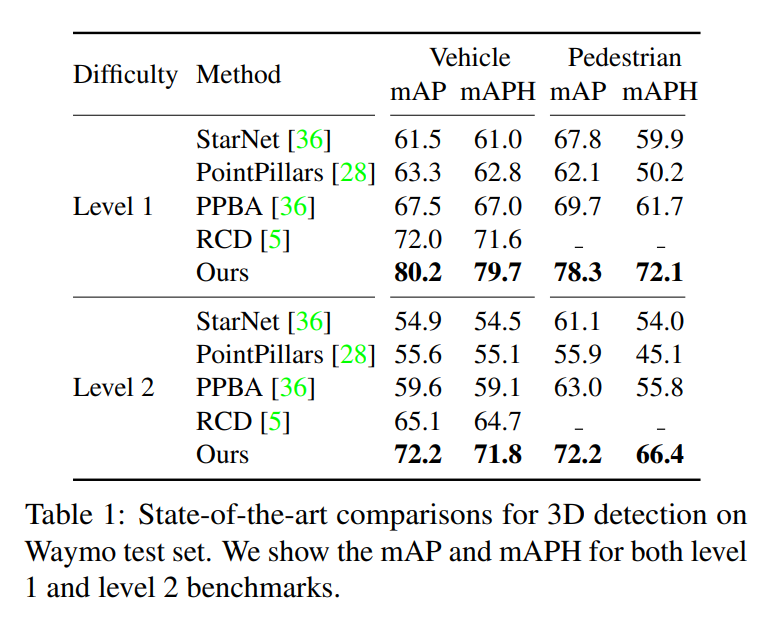
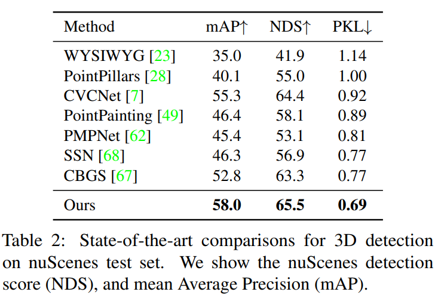
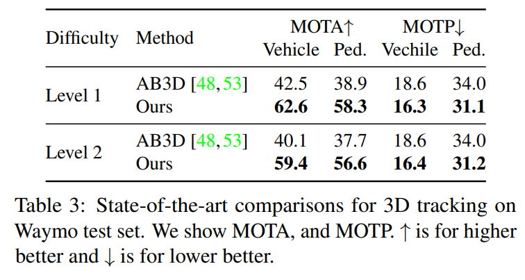
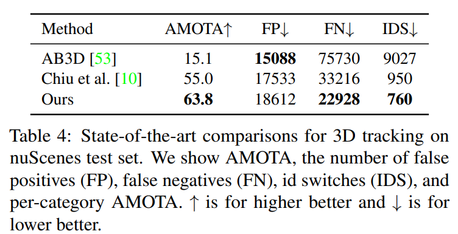
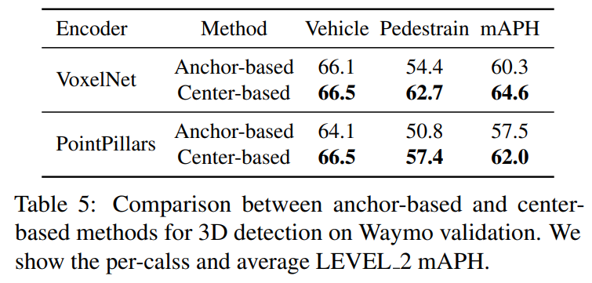
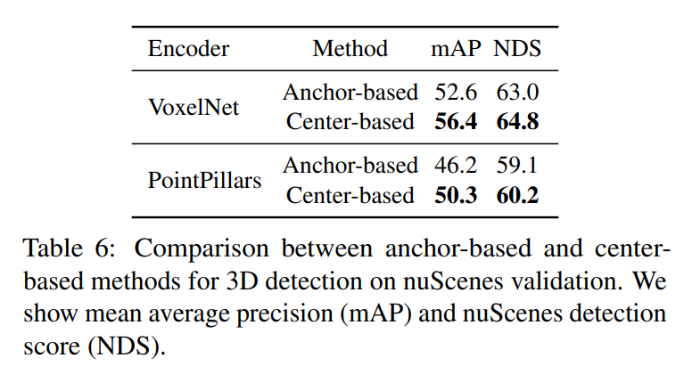
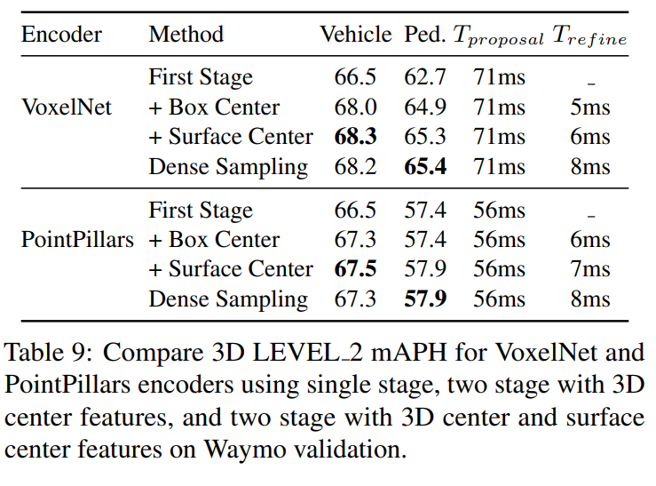

# CenterPoint for 3D object Detection and Tracking \[Kor\]

##  1. Problem definition

#### 3D Object Detection and Tracking

3D object detection이란 3D point cloud로 나타나는 3차원 공간에서 객체를 감지해, 객체를 둘러싸는 bounding box와 물체의 class를 예측하는 것이다. 3D object tracking이란 순차적인 3D point cloud로부터 객체를 지속적으로 추적하는 것이다.

---

기존의 3D object detection method들은 2D object detection에서 주로 사용되는 **anchor-based method**를 3D domain에 옮긴 방식으로 이루어졌다. Anchor-based method는 bounding box의 후보군 여러개를 만들어 그것을 분류하고 개선하는 방식으로 최종 bounding box를 찾는다. 이 방식은 2D domain에서는 훌륭한 성능을 보이지만, 3D domain에서는 몇 가지 문제점이 나타난다.

* 2차원과 달리 3차원의 bounding box들은 어떤 방향으로든 나타날 수 있다. (2차원은 x축과 y축에 정렬되는 직사각형 모양의 bounding box가 나타난다.)
* 3차원의 물체들은 매우 다양한 크기, 모양, 종횡비 등을 가질 수 있다. (예를 들어, 3차원 상에서 자전거는 매우 납작하고, 버스는 자동차에 비해 길게 나타난다.)

이 때문에 기존의 3D detection method들은 bounding box가 축에 정렬되는 경우에는 좋은 성능을 보이지만, bounding box가 회전되는 경우에는 bounding box를 정확히 추정하지 못하는 문제점이 있다. 이러한 문제를 해결/하기 위해 다양한 anchor-based 3D object detection 방식들은 모든 방향과 다양한 크기, 모양, 종횡비를 가지는 anchor를 bounding box의 후보군으로 사용하는 방식을 사용했으나 이 방식은 불필요한 계산 부담을 늘리고 false-positive(실제로는 object가 없으나 있다고 예측하는 것)의 가능성을 높인다고 한다.

## 2. Motivation

### Related work

* **2D object detection**
  2D object detection의 목적은 축에 정렬되는 bounding box를 찾는 것이다. 가장 대표적인 2D object detection method인 RCNN 계열의 method들은 category에 구애받지 않는 bounding box의 후보군들을 만들어 그것을 분류하고 개선한다. YOLO, SSD, RetinaNet은 category별로 bounding box의 후보군을 만들어 이후 그것을 분류하는 과정이 없는 것이 특징이다. 위 모델들은 모두 anchor-based method에 속한다.

  이 논문에서 주목한 것은 **center-based method**이다. CenterNet, CenterTrack은 bounding box의 후보군을 찾는 대신 object의 중심점을 찾고, object의 크기와 category를 추정하여 bounding box를 만든다. **CenterNet**은 **Keypoint Estimation**을 사용하여 object의 중심점을 구한다. 학습을 진행하는 동안 각 object의 center에 gaussian kernel을 적용한 ground truth를 사용해 center에 대한 heatmap을 학습한다. 학습한 heatmap으로부터 category 별로 peak를 뽑아내 center point를 구하고, 추가적으로 object의 크기를 추론하여 최종 bounding box를 만든다.

  

* **3D object detection**
  3D object detection의 목적은 3차원 상에서 회전되는 bounding box를 찾는 것이다. 2D object detection과 다른 점은 encoder 부분이다. 3D point cloud는  2D 이미지와 dimension이 다르고, data가 매우 띄엄띄엄 나타나기 때문에 3D point cloud에 적합한 feature extractor가 필요하다. 3D 공간에 voxel (volume과 pixel의 합성어. 2차원의 pixel과 같이 3차원의 부피를 가진 pixel을 voxel이라고 한다.)로 나누어  voxel에 속하는 point들의 feature를 추출하는 Vote3Deep, VoxelNet, SECOND 등의 encoder가 대표적이다. 이 논문에서 제안하는 **CenterPoint 방식은 어떤 3D encoder에도 적용하여 그들의 성능을 향상시킬 수 있다.**

  3D encoder를 사용해 feature를 추출하고 나면 object detection이 이루어진다. VoteNet은 point의 feature를 샘플링하고 구룹을 지어 투표 클러스터링 방식을 사용해 object detection을 수행한다. 최근의 방식들은 2D에서의 RCNN 방식을 3D에 적용한다. 이러한 방식들은 3D point들의 지역 feature를 추출하는데, 방대한 point의 개수로 인해 실행 시간이 매우 길다.

### Idea

앞서 소개한 3D anchor-based object detection method들의 문제점들을 해결하기 위해, 이 논문은 **2D object detection에서 사용된 center-based method를 3D domain에 적용**한다. Object의 중심점과 voxel에 대한 정보, 높이, 크기, 방향을 구해 object detection을 수행하고, 추가로 속도 벡터를 구해 object tracking을 수행한다.

## 3. Method

전체 구조는 총 2개의 stage로 나뉜다.

### 1st Stage

첫 번째 stage는 **기존의 3D encoder를 backbone으로** 사용하여 추출한 feature에 대해 head를 사용해 object의 중심점, voxel에 대한 정보, 높이, 크기, 방향 그리고 속도 벡터를 구하는 것이다.

* **Center heatmap head**

  Center-head의 목적은 peak값을 center로 하는 **heatmap**을 만드는 것이다. K개의 class 각각에 대응하는 K-channel의 heatmap $$\hat{Y}$$ 구하는데, 학습을 진행하는 동안 각 object의 3D center에 2D gaussian kernel을 적용한 ground truth를 사용해 center에 대한 heatmap을 학습한다. 학습을 위해 **focal loss**를 사용한다. 문제는 top-down map view(3D 공간을 수직으로 내려다보는 관점)에 나타나는 object는 이미지에 비해 드문드문 나타나고, 중심점끼리의 거리가 가까워 object의  때문에 dense prediction이 어렵다는 것이다. 이 문제를 해결하기 위해 논문은 사용하는 gaussian kernel의 radius를 $$σ = max(f(wl), τ )$$로 제한했다. 이 방식을 통해 center-head는 주변 픽셀에 대한 dense prediction이 가능해진다.
  
* **Regression heads**

  Regression-head들은 각 object들에 대해 **다양한 특징**들(sub-voxel 위치 개선을 위한 vector $$o ∈ \R^2$$, 바닥으로 부터의 높이 $$h_g ∈ \R$$, 3D 크기 $$s ∈ \R^3$$, yaw 회전 각도 $$(sin(α), cos(α)) ∈ \R^2$$)을 예측한다. 특징들은 **L1 loss**를 사용해 학습되며, 이렇게 얻어진 정보들은 3D bounding box에 대한 전체 상태 정보를 제공한다. (Center-head가 추측하는 object의 중심점은 3D bounding box에 대한 충분한 정보를 제공하지 않기 때문에 추가적인 정보가 필요하다. 예를 들어 자율주행 시, 센서는 물체의 중심점이 아닌 한 면만을 관측할 수도 있다. ) Center-head에서 구한 heatmap과 regression-head들에서 구한 feature를 결합해 bounding box를 만든다.

* **Velocity head**

  Object detection과 달리 **object tracking**을 수행하기 위해서는 **2차원의 속도 벡터 $$v ∈ \R^2$$**가 필요하다. 따라서 object tracking을 수행할 때만 추가로 velocity head가 필요하다. 속도 벡터를 추정하기 위해  현재와 바로 이전 시간의 데이터 한 쌍이 필요하다. **L1 loss**를 사용해 학습된다.
  

첫 번째 stage의 head들로부터 얻어진 object의 속성들을 결합하여 bounding box를 추정한다.

### 2nd Stage

두 번째 stage는 추정된 bounding box의 각 면의 중심점을 추출하여 첫 번째 stage에서 얻어진 bounding box를 개선하는 역할을 한다. bounding box의 중심점과 바닥면, 윗면의 중심점은 모두 같으므로 옆면 4개의 중심점을 추가로 추출하여 총 5개의 중심점을 가지게 된다. 각 중심점들에 대해서 이에 대응하는 feature들을 backbone network의 output으로부터 추출하여 bilinear interpolation을 적용한다. 그런 다음, 이 feature들을 concatenate하여 MLP를 통과시킨다. 

이를 통해 두 번째 stage는 class에 구애받지 않는 신뢰도 점수를 예측하고 첫 번째 stage에서 추정한 bounding box를 개선한다. Class에 구애받지 않는 신뢰도 점수를 위해 점수 타겟 $$I$$를 구한다.

$$
I = min(1, max(0, 2 × IoUt − 0.5))
$$
$$IoU_t$$는 $$t$$번째로 제안된 bounding box와 grountuth 사이의 $$IoU$$이다. 학습은 **binary cross entropy loss**를 사용해 이루어진다.
$$
L_{score} = −I_t log( \hat{I}_t) − (1 − I_t) log(1 − \hat{I}_t)
$$
$\hat{I}_t$는 추측된 신뢰도 점수이다. 추론하는 동안, 우리는 one-stage CenterPoint로 부터 class 추정을 하고 최종 신뢰도 점수는 아래와 같이 구한다.
$$
\hat{Q}_t = \sqrt{ \hat{Y}_t ∗ \hat{I}_t}
$$
$$\hat{Q}_t$$는 object $$t$$에 대한 최종 예측 신뢰도 점수이고, $$\hat{Y}_t = max_{0≤k≤K} \hat{Y}_{p,k}$$와 $$\hat{I}_t$$는 각각 첫 번째 stage와 두 번째 stage의 object $$t$$에 대한 신뢰도 점수이다. 

## 4. Experiment & Result

### Experimental setup

* Dataset: Waymo Open Dataset(vehicle and pedestrian) and nuScenes Dataset(driving sequences)

* 3D Encoder(Backbone) : VexelNet(CenterPoint-Voxel), PointPillars(CenterPoint-Pillar)
* Evaluation metric
  * mAP: mean average precision (Waymo Open Dataset, nuScenes Dataset)
  * mAPH: mAP p weighted by heading accuracy (Waymo Open Dataset)
  * MOTA: Multiple Object Tracking Accuracy (Waymo Open Dataset)
  * MOTP: Multiple Object Tracking Precision (Waymo Open Dataset)
  * NDS: nuScenes detection score (nuScenes Dataset)
  * PKL: KL divergence of a planner's route (nuScenes Dataset)

### **Result**

#### **3D Detection**

Waymo test set과 nuScenes test set에 대한 3D object detection 결과이다. 두 결과 모두 CenterPoint-Voxel model에 대한 것이며, 두 dataset에서 모두 previous model들을 크게 능가하는 좋은 성능을 가지는 것을 확인할 수 있다.

#### **3D Tracking**

Waymo test set과 nuScenes test set에 대한 3D object tracking 결과이다. 두 결과 모두 CenterPoint-Voxel model에 대한 것이며, 두 dataset에서 모두 previous model들을 크게 능가하는 좋은 성능을 가지는 것을 확인할 수 있다. CenterPoint를 통한 3D object tracking은 object detection을 할 때 걸리는 시간보다 $1ms$라는 매우 적은 시간만을 추가로 요구한다.

#### **Center-based vs Anchor-based**

두 dataset에 대해 anchor-based 방식을 사용한 기존의 모델과 center-based 방식을 적용한 VoxelNet과 PointPillars 모델을 비교한 것이다. Center-based 방식을 적용한 것이 더 좋은 성능을 보인다는 것을 확인할 수 있다.

#### **One-stage vs Two-stage**

Two-stage 방식을 사용했을 때(+Box center, Surface Center) One-stage 방식을 사용했을 때보다 $6ms-7ms$정도로 실행 시간이 매우 조금 늘어나지만 상당한 성능 향상을 가져온다는 것을 확인할 수 있다.

## 5. Conclusion

이 논문은 기존의 3D object detection 모델들이 가지던 문제점을 2D object detection에서 소개된 center-based method를 3D에 적용해 해결하였다. 이 논문은 간단하고 거의 실시간으로 적용할 수 있는 CenterPoint를 제안했는데, 이 모델은 3D object detection과 tracking 문제에서 모두 기존의 모델들의 성능을 크게 뛰어넘는 성과를 보였다. 또한, 기존의 3D Encoder들에 모두 적용 가능하다는 장점이 있다.

### Take home message \(오늘의 교훈\)

> 2D object detection 문제에서는 주류가 되지 못했던 center-based method를 3D object detection에 적용했을 때, 큰 성능 향상을 가져온다는 것이 흥미로웠다. 이 논문처럼 기존의 다른 문제에서 제기되었던 다양한 방식들을 내가 접한 문제에 적용해보는 것이 때로는 큰 도움이 될 수 있다는 것을 깨달았다.

## Author / Reviewer information

### Author

**이인영 \(Inyoung Lee\)** 

* KAIST EE(CILAB)

### Reviewer

1. Korean name \(English name\): Affiliation / Contact information
2. Korean name \(English name\): Affiliation / Contact information
3. ...

## Reference & Additional materials

1. [Center-based 3D Object Detection and Tracking](https://arxiv.org/abs/2006.11275)
2. [Official GitHub](https://github.com/tianweiy/CenterPoint)
3. [CenterNet](https://arxiv.org/abs/1904.08189)
4. [VoxelNet](https://arxiv.org/abs/1711.06396)
5. [PointPillars](https://arxiv.org/abs/1812.05784)
