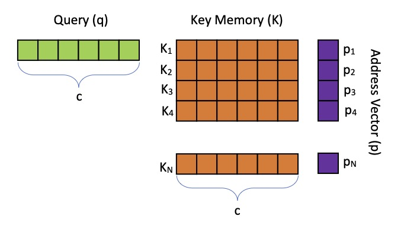

# M-CAM \[Eng\]

##  1. Problem definition

Please provide the problem definition in this section.

We recommend you to use the formal definition \(mathematical notations\).

## 2. Motivation

A class activation map(CAM) for a specific class shows the discriminative image regions used by CNN to make decision to classify images into that class.  Challenging conditioned dataset such as dataset with imbalanced distribution of class and frequent co-occurrence of multiple objects in multi-label classification training dataset might give rise to unwanted bias on internal components of the target deep network. CAM utilizes these internal components of deep networks such as gradients and feature maps to generate visual explanations. This means when it comes to challenging conditioned dataset, there is no guarantee on the reliability of internal components of deep networks which leads to degradation of credibility on generated visual explanations. 
To tackle such problems, they propose Bias-reducing memory module that provides quality visual explanations even with datasets of challenging conditions.

### Related work

#### Class Activation Map (CAM)

CAM is first introduced in [[2]](#2) where they compute weighted sum of the features at the last convolutional layer using the weights from the output layer that comes after applying global average pooling to the last convolutional layer. Afterward, Grad-CAM [[3]](#3) generalizes the concept of CAM, verifying that generation of activation map does not require specific structure (global average pool layer at the end of the network) of CNN anymore. Grad-CAM++ [[4]](#4) further generalizes Grad-CAM, enhancing its visual explanation by taking advantage of higher order derivatives for importance weight assignment. The mentioned CAM methods are the most popular ones but several other variations of CAM have been published as well, with each having specialized advantages. 

#### Key-Value Structure Memory Network

In [[5]](#5), in order to open up possibilities for open domain Question Answering task, a new dynamic neural network architecture called key-value structure memory network is introduced for storing diverse patterns of feature representation of trained images in the key memory and use it to make inference for the class-related semantic information which is stored in the value memory. This trained correlation between key and value memory will then be used to classify the input image. 

### Idea

To complement biases of the target network caused by the inherent challenging conditions of the training dataset, the proposed key-value structure memory module learns the distribution of spatial feature representation from the target deep network and discretely organizes the distributions into separate memory slots. To further boost the memory network to its fullest extent, they use the sparse dictionary learning concept from [[6]](#6), where diverse information can be stored sparsely over different memory slots.

## 3. Method

### Bias-reducing Memory

Application of key-value memory involves two major steps, which are key addressing and value reading. Given an embedded query value  with c as number of channels of the resulted spatial features , similarity between q and each slot of key memory  is measured. An address vector  is obtained for a key memory K with N slots, where each scalar value of p represents similarity between the query and each memory slot: 

  

Please note that you can attach image files \(see Figure 1\).  
When you upload image files, please read [How to contribute?](../../how-to-contribute.md#image-file-upload) section.

We strongly recommend you to provide us a working example that describes how the proposed method works.  
Watch the professor's [lecture videos](https://www.youtube.com/playlist?list=PLODUp92zx-j8z76RaVka54d3cjTx00q2N) and see how the professor explains.

## 4. Experiment & Result

This section should cover experimental setup and results.  
Please focus on how the authors of paper demonstrated the superiority / effectiveness of the proposed method.

Note that you can attach tables and images, but you don't need to deliver all materials included in the original paper.

### Experimental setup

This section should contain:

* Dataset
* Baselines
* Training setup
* Evaluation metric
* ...

### Result

Please summarize and interpret the experimental result in this subsection.

## 5. Conclusion

In conclusion, please sum up this article.  
You can summarize the contribution of the paper, list-up strength and limitation, or freely tell your opinion about the paper.

### Take home message \(오늘의 교훈\)

Please provide one-line \(or 2~3 lines\) message, which we can learn from this paper.

> All men are mortal.
>
> Socrates is a man.
>
> Therefore, Socrates is mortal.

## Author / Reviewer information

### Author

**김성엽 \(Kim Seongyeop\)** 

* Affiliation \KAIST EE
* Contact information \seongyeop@kaist.ac.kr

### Reviewer

## Reference & Additional materials

[1]  
<a id="2">[2]</a> 
Bolei Zhou, Aditya Khosla, Agata Lapedriza, Aude Oliva, and Antonio Torralba. Learning deep features for discriminative localization. In Conference on Computer Vision and Pattern Recognition (CVPR), pages 2921–2929, 2016.  
<a id="3">[3]</a>
Ramprasaath R Selvaraju, Michael Cogswell, Abhishek Das, Ramakrishna Vedantam, Devi Parikh, and Dhruv Batra. Grad-cam: Visual explanations from deep networks via gradient-based localization. In International Conference on Computer Vision (ICCV), pages 618–626, 2017.  
<a id="4">[4]</a>
Aditya Chattopadhay, Anirban Sarkar, Prantik Howlader, and Vineeth N Balasubrama- nian. Grad-cam++: Generalized gradient-based visual explanations for deep convolu- tional networks. In Winter Conference on Applications of Computer Vision (WACV), pages 839–847. IEEE, 2018.  
<a id="5">[5]</a>
Alexander Miller, Adam Fisch, Jesse Dodge, Amir-Hossein Karimi, Antoine Bordes, and Jason Weston. Key-value memory networks for directly reading documents. In Proceedings of the 2016 Conference on Empirical Methods in Natural Language Pro- cessing, pages 1400–1409, Austin, Texas, November 2016. Association for Computa- tional Linguistics. doi: 10.18653/v1/D16-1147.  
<a id="6">[6]</a>
Kenneth Kreutz-Delgado, Joseph F Murray, Bhaskar D Rao, Kjersti Engan, Te-Won Lee, and Terrence J Sejnowski. Dictionary learning algorithms for sparse representa- tion. Neural computation, 15(2):349–396, 2003.  

